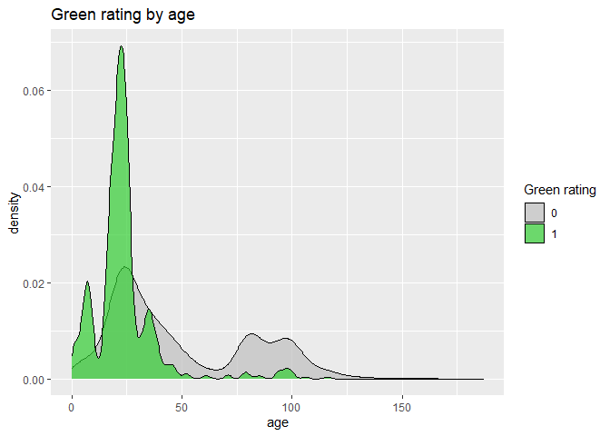
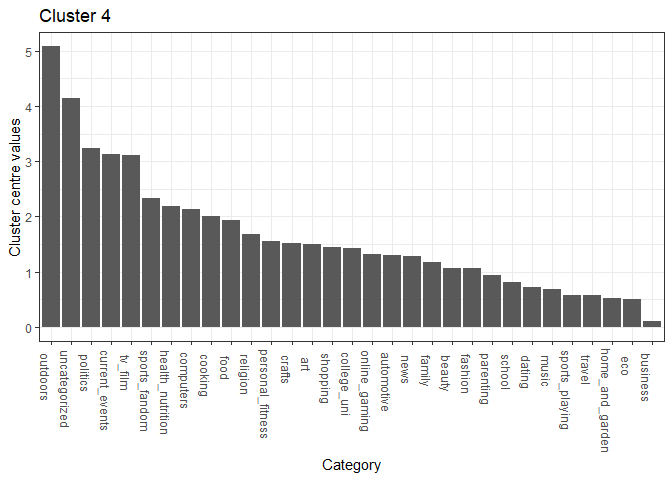
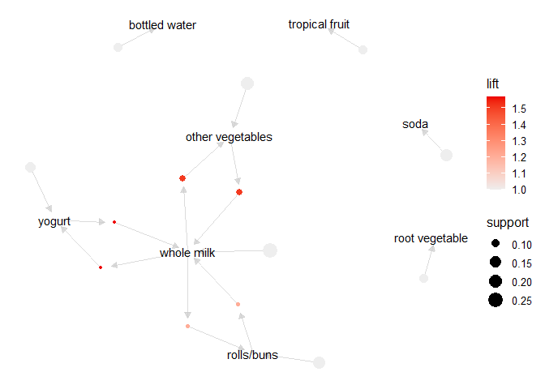
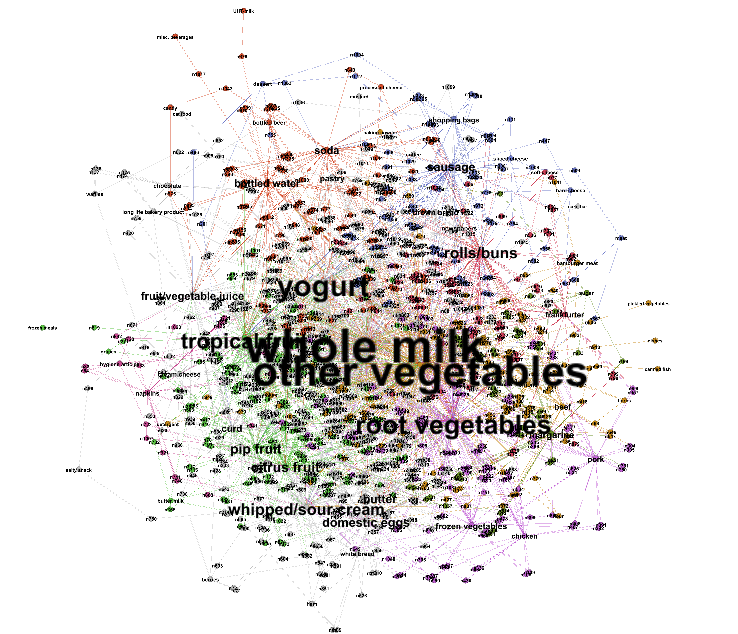
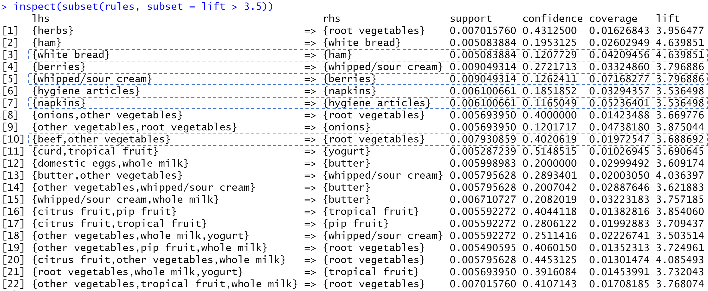

Link to RMD file: <https://github.com/its-safi/STA380_EXAM_2>

-   ***Group Members***

    -   Bhavana Reddy 
    -   Palak Agarwal
    -   Safiuddin Mohammed

# Problem 1: Visual story telling part 1: green buildings

The real estate developer essentially wants to know if investing in a
green building would be worth it, in terms of economic benefits. And
while on the first glance it made sense that the Excel guru computed the
expected revenue using the median rent values for green buildings, it
could not be that straightforward, can it? Maybe - it is possible that
the higher rent values in green building is due to them being green, but
it is also possible that it is there due to some other attribute that is
correlated with green buildings. In case of the latter, it is essential
to explore this confounding attribute in order to provide the right
recommendation to the developer.

Let’s explore some variables to see if they have a relationship with the
green ratings

As we explored the many other variables in addition to the above graphs,
the variable *age* i.e. the age of the building in years and the
variable *class\_a* i.e. the indicator of highest quality properties
caught our attention. We could clearly see some patterns. The green
buildings are mostly young and proportion of green buildings is higher
among the class a buildings.

Going back to our original question of the confounding variable, is it
possible that the higher median rent of the green buildings was being
driven by their age (*well this would be great for the developer since
she is building a new property*)? Or is it possible that the green
buildings in our data set came out to be desirable because many belonged
to the class\_a category? Let’s find out.

As seen from above, age and rent does not appear to have a correlation.
The class\_a indicator, however, seems to be influencing the rent. We
can see that the median rent is higher for buildings which are qualified
as class a.

Now, let’s look at the median rent values for green buildings split by
whether they belong to the class a category of buildings or not.

The median rent value for green buildings when they belong to the class
a category is 28.44 but only 25.55 when they don’t. Additionally, if the
developer ends up investing in green building that doesn’t belong to the
class a category, the economic benefits are tend to be lower as compared
to a class\_a, non-green building.

Now, given that the excel guru’s insight is based on the premise that
the green building will generate more revenue as compared to a non-green
building, we can clearly see from above that might not be the case
truly. The class a indicator seems to be playing a big role here.

So, our recommendation to the developer would be to invest in a green
building if it is also a class a building.

Let’s also look at the occupancy rates for these buildings:

**Summarizing:**

-   We first discovered that most green buildings are young and a higher
    proportion of green buildings belong to the class a category

-   We then looked at the association of age and class a category with
    rent. Although, there was not a high correlation between age and
    rent, we could clearly see that the median rent value of class a
    buildings is higher as compared to those that aren’t class a

-   The above suggests a possibility that higher rent value of the green
    buildings as concluded by the Excel guru might not be because of
    their green certification, but rather because of their class a
    qualification

-   As we deep-dived to check the median rent values for buildings split
    by both their green certification and class a qualification, we
    discovered that median rent value of a non-class a, green building
    is lower than that of a class a, non-green building. Hence, it
    wouldn’t be wise for the real estate developer to invest into a
    green building without exploring the class status of the building

-   We also checked the occupancy rate of the buildings for this split,
    which is also higher for class a buildings

-   Considering the above points - we recommend the real estate
    developer invest in a green building only if it is also a class a
    building

# Problem 2: Visual story telling: flights at ABIA

### **Problem**

Consider the data in ABIA.csv, which contains information on every
commercial flight in 2008 that either departed from or landed at
Austin-Bergstrom Interational Airport.

Your task is to create a figure, or set of related figures, that tell an
interesting story about flights into and out of Austin. You can annotate
the figure and briefly describe it, but strive to make it as stand-alone
as possible. It shouldn’t need many, many paragraphs to convey its
meaning. Rather, the figure should speak for itself as far as possible.

### **Objectives**

-   ***Data Introduction and Volumes***

    -   Volume of Delayed, Cancelled, Ontime Flights
    -   Volume of Flights by Carrier Operation
    -   Volume of Flights by Destination

-   ***Analysis of Delays and Cancellations***

    -   Distribution of Delay time by Arrivals and Departures.
    -   Correlation between Arrival Delay and Departure Delay
    -   Reasons for Delay
    -   Delays impact by Destination

-   ***Carrier Analysis***

    -   Volume of Flights Delayed / Cancelled by Carrier Operation
    -   Percentage Delay by substantial Carriers.

### **Data Introduction and Volumes**

<h4>
Volume of Flights by Delayed, Ontime, Cancelled
</h4>

<b> Observations : </b> Surprisingly, nearly 50% of flights seem to be
delayed (Either Arrival or Departure). This however does not tell the
full story as we include flights that are delayed by even 1 minute. As
we analyse delay further later, the information becomes more valid.

<h4>
Volume of Flights by Carrier
</h4>

<b> Observations : </b> Southwest(WN) tops the list with almost 40k
operations, followed by Alaskan Airlines(AA). Northwest Airlines(NW) has
the fewest operations with just 121.

<b> Observations : </b> We see that most flights are within state incase
of both Outbound and Inboud from ABIA. Interms of Out-Of-State flights,
we see maximam flights flying between California and Austin.

### ***Analysis of Delays and Cancellations***

Now that we have an overview of the data, we focus on delays.

<h4>
Distribution of Delay time by Arrivals and Departures
</h4>

<b> Observations : </b> Both Delay at departure and delat at arrival are
centered at 0. As expected most flight take off and arrive on time.
There are some major outliers.

<h4>
Correlation between Arrival Delay and Departure Delay
</h4>

<b> Observations : </b> As expected, most flights that depart late,
arrive late. However, there are several flights, that although Depart
late are able to Arrive on time.

<h4>
Reasons for Delay
</h4>

<b> Observations </b> : Maximum number of flighs are delayed due to
NASDelay, however, they do not result in maximum amount of delay.
LateAircraft delay seems to be most time expensive although slightly
less frequent.

<h4>
Delay by Destination
</h4>

<b> Note : </b> All delays are aggregated then normalized by number of
flights. To maintain scale we have log transformed the delays, to habdle
states that had just one flight.

<b> Observation : </b>

-   Maximum departure delay is seen at ABIA airport when flights are
    departing for the Des Moines Internainal Airport, Iowa.
-   Maximum Arrival delay is seen for Inbound flights to ABIA airport
    when arriving from Dulles International Airport, Virginia

### ***Analysis of Carriers and How they perform in terms of Delay***

<h4>
Delay by Carriers
</h4>

<b> Observations : </b> We see that most flights carriers maintain a
ontime/delayed &gt;1 ratio. This is indicative of volume proportion. In
the below graph we see the percentage of flights that are delayed by
each carrier.

<h4>
Percentage delay by Carriers
</h4>

<b> Observation : </b> Southwest Airlines (WN), EVA Air(EV) and Delta
airlines(DL) had maximum percentage of flights delayed in 2008,while US
Airways (US),Endeavor Air(9E) and Mesa Airlines (YV) had least
percentage of flights delayed.

# Problem 3: Portfolio Modelling

### **Problem Statement**

Construct three different portfolios of exchange-traded funds (ETFs),
and use bootstrap resampling to analyze the short-term tail risk of the
portfolios

### **Solution**

We have selected ETFs that vary accross different levels of risk to
create three versatile portfolios.

We will be looking at the ETFs **“QQQ”, “VUG”, “IWF”, “USMV”,“YYY
and”SPLV"** and have divided the risk levels of the ETFs into

-   High risk ETFs : **QQQ, VUG, IWF**
-   Low risk ETFs : **USMV, YYY and SPLV**

A high-risk ETF is one for which there is either a large percentage
chance of loss of capital or under-performance—or a relatively high
chance of a devastating loss. However, it may have chances of providing
very high returns.

A low-risk ETF has less at stake in terms of the amount invested or the
significance of the investment to the portfolio

We will be considering 5 years of ETF data starting from 05-29-2015 to
build our portfolios.

Sample Data for QQQ (High risk ETF)

    ##            QQQ.Open QQQ.High QQQ.Low QQQ.Close QQQ.Volume QQQ.Adjusted
    ## 2021-08-11   368.14   368.65  364.84    366.21   34249800       366.21
    ## 2021-08-12   365.69   367.90  364.30    367.53   25969200       367.53
    ## 2021-08-13   367.89   369.16  367.38    368.82   19318800       368.82

Sample Data for YYY (Low risk ETF)

    ##            YYY.Open YYY.High YYY.Low YYY.Close YYY.Volume YYY.Adjusted
    ## 2021-08-11    17.43    17.45   17.41     17.43      99000        17.43
    ## 2021-08-12    17.46    17.46   17.41     17.41     107000        17.41
    ## 2021-08-13    17.45    17.45   17.37     17.42     187700        17.42

By computing the correlation between the stocks, we can be observe that
the relationship is non-linear and there is no fixed pattern. Some
stocks are performing well, while some are not performing well.

The initial wealth given to us is $100,000. We will look at three
different portfolio models.

-   Model 1 : **Low-risk Portfolio**
-   Model 2 : **High risk Portfolio**
-   Model 3 : **Mixed Portfolio**

#### **Model 1 : Low-risk Portfolio**

For the low-risk portfolio, we will distribute 60% of the total wealth
among the low risk ETFs - **USMV, YYY and SPLV**, and the remaining 40%
of the total wealth among the high risk ETFs.

By observing the graphs below, we can conclude that for the low-risk
portfolio :

-   The average return of investment after 20 days is approximatly
    $82,600
-   The 5% value at risk for the low-risk portfolio is approximately
    -$23,600

    ## Confidence Interval from Bootstrap Distribution (5000 replicates)

The return on investment is negative for the low-risk portfolio

#### **Model 2 : High-risk Portfolio**

For the high-risk portfolio, we will distribute 60% of the total wealth
among the high risk ETFs - **QQQ, YUG and IWF**, and the remaining 40%
of the total wealth among the high risk ETFs.

By observing the graphs below, we can conclude that for the high-risk
portfolio :

-   The average return of investment after 20 days is approximatly
    $82,900
-   The 5% value at risk for the low-risk portfolio is -$23,800
    

<!-- -->

    ## Confidence Interval from Bootstrap Distribution (5000 replicates)

The return after 20 days for the high-risk portfolio is higher than the
low-risk portfolio, but it is still negative.

#### **Model 3 : Mixed Portfolio**

For the mixed portfolio, we will equally distribute the total wealth
among the high-risk and low-risk ETFs.

By observing the graphs below, we can conclude that for the mixed
portfolio :

-   The average return of investment after 20 days is approximatly
    $101,100
-   The 5% value at risk for the low-risk portfolio is -$6,900

    ## Confidence Interval from Bootstrap Distribution (5000 replicates)

The return after 20 days is postive for the mixed portfolio

#### **Summary**

Although we would assume the low-risk or high-risk portfolio to give us
the highest 20 day returns, the mixed portfolio gives us the highest
returns and lowest 5% value at risk.

# Problem 4: Market Segmentation

### **Problem**

Consider the data in social\_marketing.csv. This was data collected in
the course of a market-research study using followers of the Twitter
account of a large consumer brand that shall remain nameless—let’s call
it “NutrientH20” just to have a label. The goal here was for NutrientH20
to understand its social-media audience a little bit better, so that it
could hone its messaging a little more sharply.

Your task to is analyze this data as you see fit, and to prepare a
concise report for NutrientH20 that identifies any interesting market
segments that appear to stand out in their social-media audience. You
have complete freedom in deciding how to pre-process the data and how to
define “market segment.” (Is it a group of correlated interests? A
cluster? A latent factor? Etc.) Just use the data to come up with some
interesting, well-supported insights about the audience, and be clear
about what you did.

### **Steps taken**

There are 36 total variables present. In the process of clustering we
perform the fllowing steps :

-   K-means with the raw data
    -   To detrmine K we use the following methods
        -   Calculation of WSS and Elbow plot
        -   Silhouette Analysis
        -   Gap Statistic Method
        -   Trial and Observations Method
    -   Summary of Clusters and Observations
-   K-means with k-means++ initialization

<h4>
K-means with Raw Data
</h4>

<h5>

No conclusive K value could be derived from the Elbow plot, Sillhoutte
Method and the Gap Statisti Method. However based on Trials and
Observations we concluded that the best k value availaible could be 5
(Somewhat in congruence with the Elbow plot). Also after many trials, we
can remove variables such as chatter, spam and adult. This is because of
the observation that they were constantly not in the important variable
for any cluster, or were in the important variables bracket for all
clusters

-   Based on our observations, please find cluster map below

</h5>

**Market segments identified**

-   Cluster 1. College Uni,Current Events, Shopping, Online Gaming,
    Travel
-   Cluster 2. Cooking, Fasion, Beauty, Health Nutrition
-   Cluster 3. Sports Fandon, Religion, Food, Parenting
-   Cluster 4. Health Nutrition, Personal Fitness, Cooking, Outdoor
-   Cluster 5. Politics, Travel, News, Computers, Sports Fandom

> Intuitively, The clusters make a lot of sense. Cluster 1 seems to
> belong to a young age group of College Students, Talking of Travel,
> Shopping Gaming etc. Cluster 2 may indicate a market segment of
> mid-age people, interesten in Fashion, Beauty Cooking and Health.
> Cluster 4 and 5 show similar intuitive clusters.

<h5>
Correlation plot
</h5>

Several Variables are correlated with one another. PCA will take
advantage of these high correaltions and return reduced Dimensions.

<h5>
Principal Component Analysis
</h5>

    cumsum(pca_var1)[10]

    ## [1] 0.653273

At 10th PC, around 63.37% of the variation is explained. According to
Kaiser criterion, we should drop all the principal components with eigen
values less than 1.0. Hence, <b> let’s pick 10 principal components.
</b>

#### **Cluster visualization**

The clusters seem to be well defined. Based on this let us find
characteristics of seperation, and conclude our clusters.

**Market segments identified by Kmeans++ and PCA**

-   Cluster 1. Travel, Health Nutrition, Cooking, Sports Fandom
-   Cluster 2. Sports Fandom, Automotive, Politics, Current Events
-   Cluster 3. Outdoors, Politics, Current Events, TVFilm
-   Cluster 4. Travel, Current Events, Computers
-   Cluster 5. Politics, Health Nutrition, Art, Current Events
-   Cluster 6. TVFilm, Health Nutrition, Current Events

> These clusters make a lot of sense intuitively as well. As seen in
> Cluster 1 , Travel, Health Nutrition, Cooking and Sports seem to be a
> cluster belonging to a young demographic. Cluster 2 indicates a group,
> which is up to date with current events including Politics, Sports
> etc,.

<b> Over all, I personally prefer raw kmeans clusters. Both methods
indicate meaningful Clusters. With this understanding, we may segregate
tweets and understand the rationale behind them better. By creating
market segments we can be more direct and productive in decision making
and responses to tweets.</b>

# Problem 5: Author attribution

### **Problem Statement**

The task is to build the best model, using any combination of tools, for
predicting the author of an article on the basis of that article’s
textual content. Describe clearly the models being used, how the
features were constructed, and so forth.

Use the C50train data (and this data alone) to build the model. Then
apply the model to predict the authorship of the articles in the C50test
directory. Describe the data pre-processing and analysis pipeline in
detail.

#### **Data Processing**

##### **Step 1 : Reading the Train data**

To begin the author attribution model, we need to first read in the
C50Train data, and create a train data set. There are three steps to
this :

-   Read the list of authors (We take the last 50 characters of the file
    name to ensure it contains the name of the author )
-   Read the list of articles written by the authors
-   Clean the list of articles written by the authors by removing
    unwanted/extra text

Initial train data set

    ## [1] "C:/Users/palak/Downloads/Final/Final/Data/C50train/AaronPressman" 
    ## [2] "C:/Users/palak/Downloads/Final/Final/Data/C50train/AlanCrosby"    
    ## [3] "C:/Users/palak/Downloads/Final/Final/Data/C50train/AlexanderSmith"

List of authors

    ## [1] "n/AaronPressman" "n/AaronPressman" "n/AaronPressman"

List of articles written by the authors

    ## [1] "C:/Users/palak/Downloads/Final/Final/Data/C50train/AaronPressman/106247newsML.txt"
    ## [2] "C:/Users/palak/Downloads/Final/Final/Data/C50train/AaronPressman/120600newsML.txt"
    ## [3] "C:/Users/palak/Downloads/Final/Final/Data/C50train/AaronPressman/120683newsML.txt"

List of articles written by authors after removing unnecessary text

    ## [1] "C:/Users/palak/Downloads/Final/Final/Data/C50train/AaronPressman/106247newsML"
    ## [2] "C:/Users/palak/Downloads/Final/Final/Data/C50train/AaronPressman/120600newsML"
    ## [3] "C:/Users/palak/Downloads/Final/Final/Data/C50train/AaronPressman/120683newsML"

##### **Step 2 : Creating a text mining corpus**

We combine all of our cleaned train data to create a text mining corpus.
This is a representative sample of our data set.

##### **Step 3 : Pre-processing and Tokenization**

We need to perform some pre-processing on the data to clean it up before
we run our models on it. The different transformations we perform are :

-   Convert the all the alphabets to lowercase
-   Remove numbers and punctuation
-   Strip white spaces - spaces, tabs, etc
-   Create stem words. This means that words like ‘dance’, ‘dancing’,
    ‘dances’, etc all become ‘dance’
-   Remove stop words. These include words like ‘the’, ‘a’, ‘to’, that
    occur frequently in English.

##### **Step 4 : Creating Document term matrix and removing sparse terms**

We create the document term matrix (DTM), which is a matrix containing
the count of words in each document.

    ## <<DocumentTermMatrix (documents: 2500, terms: 32570)>>
    ## Non-/sparse entries: 537861/80887139
    ## Sparsity           : 99%
    ## Maximal term length: 66
    ## Weighting          : term frequency (tf)

We can see that the document contains 32,571 words and 99% of the matrix
is sparse (i.e they have 0 values)

we will remove values that are the most uncommon as they add noise to
the data. We remove the terms that have count 0 in &gt;99% of documents

    ## <<DocumentTermMatrix (documents: 2500, terms: 3393)>>
    ## Non-/sparse entries: 422971/8059529
    ## Sparsity           : 95%
    ## Maximal term length: 66
    ## Weighting          : term frequency (tf)

We now have 3394 terms, and 95% of the matrix is sparse making it easier
to process this data.

##### **Step 5 : Creating Inverse Document term matrix and removing sparse terms**

Similar to what we did for DTM, we create the Inverse document term
matrix and remove the sparse terms.

    ## <<DocumentTermMatrix (documents: 2500, terms: 3393)>>
    ## Non-/sparse entries: 382971/8099529
    ## Sparsity           : 95%
    ## Maximal term length: 66
    ## Weighting          : term frequency - inverse document frequency (normalized) (tf-idf)

##### **Step 6 : Reading the Test data**

We now read in the Test data and repeat **Step 1 to Step 5** of the
processing done on training data, on the test data.

    ## <<DocumentTermMatrix (documents: 2500, terms: 3393)>>
    ## Non-/sparse entries: 419314/8063186
    ## Sparsity           : 95%
    ## Maximal term length: 66
    ## Weighting          : term frequency (tf)

    ## <<DocumentTermMatrix (documents: 2500, terms: 3393)>>
    ## Non-/sparse entries: 379314/8103186
    ## Sparsity           : 96%
    ## Maximal term length: 66
    ## Weighting          : term frequency - inverse document frequency (normalized) (tf-idf)

We have 3394 terms, and 96% of the matrix is sparse for the test data as
well. We can now use our models on this train and test data set.

#### **Dimentionality Reduction**

##### **Step 7 : Principal Component Analysis**

We use Principal Component analysis on our data set to :

-   Extract relevant features from the huge set of variables
-   Eliminate the effect of multi-collinearity while not losing out on
    relevant information from the correlated variables

The Principal component analysis generated 2500 principal components. We
can see that at close to PC 724, almost 75% of the variance is
explained. Hence, we consider 724 of the 2500 Prinicpal components for
our analysis.

**NOTE :** we cannot run PCA on the train and test data together. Nor
can we run PCA on train data and then use it to predict the test data
values. We take the transformations of the training data and use them to
change the test data. This is by using the predict function.

We can now test our models on this new transformed data.

#### **Classification Models**

##### **Model 1 : Random Forests**

For the Random Forests model, the analysis pipeline was as follows

-   We derived important features from the text
-   Using 250 of the important features, gave us an accuracy of 60%,
    whereas using all the features gave us an accuracy of 76%

The Random Forest model provided an accuracy of **76.44%**. The model
was able to correctly predict the authorship of **1,911** authors.

##### **Model 2 : Naive Bayes**

For the Naive Bayes model, the analysis pipeline was as follows

-   The technique used for Naive Bayes was a “bag of words” model.
-   The probabilities of each occurrence of a set of words was
    compounded
-   Finally, using the Bayes rule, we estimated the probability vectors
    for each vector of word counts

The Naive Bayes model provided an accuracy of **32.48%**. The model was
able to correctly predict the authorship of **812** authors.

##### **Model 3 : K Nearest neighbors**

For the K Nearest Neighbors model the analysis pipeline was as follows

-   Pre-processing : We removed the super rare and stop words
-   Dimensionality reduction : The transformed data from PCA was used as
    this was giving us better results, as compared to directly
    performing KNN on the data
-   The cosine distance measure was used to compute the nearest
    neighbours

The K Nearest Neighbours model provided an accuracy of **33.52%**. The
model was able to correctly predict the authorship of **838** authors.

### **Conclusion**

We used 3 different classification models on the transformed data to
predict the author for the documents. Random forest, with an accuracy of
76.44% provides the best accuracy out of the three models.

# Problem 6 : Association Rule Mining

The data contains a list of grocery purchases with each row representing
one shopping basket containing one or more grocery items. Our analysis
aims at finding interesting association rules between these items. This
is followed by a few recommendations that the grocery stores can
consider in order to leverage these discoveries and enhance the customer
experience / sales.

Let’s run the Apriori algorithm.

    ## Apriori
    ## 
    ## Parameter specification:
    ##  confidence minval smax arem  aval originalSupport maxtime support minlen
    ##         0.1    0.1    1 none FALSE            TRUE       5   0.005      1
    ##  maxlen target  ext
    ##       6  rules TRUE
    ## 
    ## Algorithmic control:
    ##  filter tree heap memopt load sort verbose
    ##     0.1 TRUE TRUE  FALSE TRUE    2    TRUE
    ## 
    ## Absolute minimum support count: 49 
    ## 
    ## set item appearances ...[0 item(s)] done [0.00s].
    ## set transactions ...[169 item(s), 9835 transaction(s)] done [0.00s].
    ## sorting and recoding items ... [120 item(s)] done [0.00s].
    ## creating transaction tree ... done [0.00s].
    ## checking subsets of size 1 2 3 4 done [0.00s].
    ## writing ... [1582 rule(s)] done [0.00s].
    ## creating S4 object  ... done [0.00s].

In the chart above, we can see just a few data points that fall beyond
0.05 value of support. Let’s look at these comparatively high support
associations.

**Subset of rules when support &gt; 0.05**

    ##      lhs                   rhs                support    confidence coverage 
    ## [1]  {}                 => {bottled water}    0.11052364 0.1105236  1.0000000
    ## [2]  {}                 => {tropical fruit}   0.10493137 0.1049314  1.0000000
    ## [3]  {}                 => {root vegetables}  0.10899847 0.1089985  1.0000000
    ## [4]  {}                 => {soda}             0.17437722 0.1743772  1.0000000
    ## [5]  {}                 => {yogurt}           0.13950178 0.1395018  1.0000000
    ## [6]  {}                 => {rolls/buns}       0.18393493 0.1839349  1.0000000
    ## [7]  {}                 => {other vegetables} 0.19349263 0.1934926  1.0000000
    ## [8]  {}                 => {whole milk}       0.25551601 0.2555160  1.0000000
    ## [9]  {yogurt}           => {whole milk}       0.05602440 0.4016035  0.1395018
    ## [10] {whole milk}       => {yogurt}           0.05602440 0.2192598  0.2555160
    ## [11] {rolls/buns}       => {whole milk}       0.05663447 0.3079049  0.1839349
    ## [12] {whole milk}       => {rolls/buns}       0.05663447 0.2216474  0.2555160
    ## [13] {other vegetables} => {whole milk}       0.07483477 0.3867578  0.1934926
    ## [14] {whole milk}       => {other vegetables} 0.07483477 0.2928770  0.2555160
    ##      lift     count
    ## [1]  1.000000 1087 
    ## [2]  1.000000 1032 
    ## [3]  1.000000 1072 
    ## [4]  1.000000 1715 
    ## [5]  1.000000 1372 
    ## [6]  1.000000 1809 
    ## [7]  1.000000 1903 
    ## [8]  1.000000 2513 
    ## [9]  1.571735  551 
    ## [10] 1.571735  551 
    ## [11] 1.205032  557 
    ## [12] 1.205032  557 
    ## [13] 1.513634  736 
    ## [14] 1.513634  736

As expected, high support grocery item sets are also the popular ones.
We can see a lot of rows with empty left-hand side. Their right-hand
side contain the super popular items that are meeting our minimum
support threshold. Their confidence, however, is low as compared to the
rest of the associations because they condition on nothing but the
entire data set. Further, in the below chart (where red to green
represent low to high betweenness centrality), whole milk and vegetables
appear to have very high betweenness centrality.

Nevertheless, aren’t milk and vegetables some things that we have in our
own baskets on most of our grocery shopping trips? So let’s explore
further to see if we can find some more interesting associations.

Again, if we look at the very first graph, there are only a few data
point whose confidence is above 0.6. Let’s check them out.

**Subset of rules when confidence &gt; 0.6**

    ##      lhs                        rhs                    support confidence    coverage     lift count
    ## [1]  {onions,                                                                                       
    ##       root vegetables}       => {other vegetables} 0.005693950  0.6021505 0.009456024 3.112008    56
    ## [2]  {curd,                                                                                         
    ##       tropical fruit}        => {whole milk}       0.006507372  0.6336634 0.010269446 2.479936    64
    ## [3]  {domestic eggs,                                                                                
    ##       margarine}             => {whole milk}       0.005185562  0.6219512 0.008337570 2.434099    51
    ## [4]  {butter,                                                                                       
    ##       domestic eggs}         => {whole milk}       0.005998983  0.6210526 0.009659380 2.430582    59
    ## [5]  {butter,                                                                                       
    ##       whipped/sour cream}    => {whole milk}       0.006710727  0.6600000 0.010167768 2.583008    66
    ## [6]  {bottled water,                                                                                
    ##       butter}                => {whole milk}       0.005388917  0.6022727 0.008947636 2.357084    53
    ## [7]  {butter,                                                                                       
    ##       tropical fruit}        => {whole milk}       0.006202339  0.6224490 0.009964413 2.436047    61
    ## [8]  {butter,                                                                                       
    ##       root vegetables}       => {whole milk}       0.008235892  0.6377953 0.012913066 2.496107    81
    ## [9]  {butter,                                                                                       
    ##       yogurt}                => {whole milk}       0.009354347  0.6388889 0.014641586 2.500387    92
    ## [10] {domestic eggs,                                                                                
    ##       pip fruit}             => {whole milk}       0.005388917  0.6235294 0.008642603 2.440275    53
    ## [11] {domestic eggs,                                                                                
    ##       tropical fruit}        => {whole milk}       0.006914082  0.6071429 0.011387900 2.376144    68
    ## [12] {pip fruit,                                                                                    
    ##       whipped/sour cream}    => {other vegetables} 0.005592272  0.6043956 0.009252669 3.123610    55
    ## [13] {pip fruit,                                                                                    
    ##       whipped/sour cream}    => {whole milk}       0.005998983  0.6483516 0.009252669 2.537421    59
    ## [14] {fruit/vegetable juice,                                                                        
    ##       other vegetables,                                                                             
    ##       yogurt}                => {whole milk}       0.005083884  0.6172840 0.008235892 2.415833    50
    ## [15] {other vegetables,                                                                             
    ##       root vegetables,                                                                              
    ##       whipped/sour cream}    => {whole milk}       0.005185562  0.6071429 0.008540925 2.376144    51
    ## [16] {other vegetables,                                                                             
    ##       pip fruit,                                                                                    
    ##       root vegetables}       => {whole milk}       0.005490595  0.6750000 0.008134215 2.641713    54
    ## [17] {pip fruit,                                                                                    
    ##       root vegetables,                                                                              
    ##       whole milk}            => {other vegetables} 0.005490595  0.6136364 0.008947636 3.171368    54
    ## [18] {other vegetables,                                                                             
    ##       pip fruit,                                                                                    
    ##       yogurt}                => {whole milk}       0.005083884  0.6250000 0.008134215 2.446031    50
    ## [19] {citrus fruit,                                                                                 
    ##       root vegetables,                                                                              
    ##       whole milk}            => {other vegetables} 0.005795628  0.6333333 0.009150991 3.273165    57
    ## [20] {root vegetables,                                                                              
    ##       tropical fruit,                                                                               
    ##       yogurt}                => {whole milk}       0.005693950  0.7000000 0.008134215 2.739554    56
    ## [21] {other vegetables,                                                                             
    ##       tropical fruit,                                                                               
    ##       yogurt}                => {whole milk}       0.007625826  0.6198347 0.012302999 2.425816    75
    ## [22] {other vegetables,                                                                             
    ##       root vegetables,                                                                              
    ##       yogurt}                => {whole milk}       0.007829181  0.6062992 0.012913066 2.372842    77

Here are some of the associations. Other vegetables appear quite often
in grocery baskets that contain root vegetables, fruits, milk etc.
Similarly, whole milk seems to be frequently present in grocery baskets
that contain vegetables, fruits, butter, cream or yogurt.

Grocery stores may consider having the dairy and vegetable sections
adjacent to each other for the ease of navigation may enhance the
customer experience. The below chart is also helpful to visualize
different clusters of our items - we can see dairy and vegetables go
together.

Confidence, however, is not enough to evaluate the strength of the
associations. It is also worthwhile to consider how this confidence
relates to the expected confidence (i.e. baseline occurrence) of the rhs
item, essentially the lift.

A lift of 1 would mean that the lhs and rhs item sets are independent,
essentially no association. So, we want to look at some high lift
associations. Below is again the very first graph, but with lift on the
y-axis. Only a few data points fall above 3.5 value of lift. Let’s take
a loot at these.

All of the above item sets appear quite infrequently in our data set.
The lift, however, is high and suggests that grocery stores maybe able
to increase the sales of these items by leveraging these association
rules.

We had earlier suggested that grocery stores may consider having the
dairy and vegetable sections alongside each other for the convenience of
the customers. Here are some more recommendations based on the high lift
associations we just saw:

-   Berries can be put alongside whipped/sour cream in the stores as
    their likelihood to be purchased with whipped/sour cream is about
    3.8 times higher as compared to their baseline likelihood of being
    bought. Strawberries with whipped cream - people surely have a good
    taste!

-   Ham is more likely to be purchased along with the white bread.
    Grocery stores can have them on display together along with
    advertisement posters of a recipe that include them. It is also
    interesting that root vegetables are more likely to be purchased
    with beef. Something similar could be done with these as well

-   Napkins and hygiene products can be made available for some combo
    discounts
