“Link for rmd file”

# Visual story telling part 1: green buildings

The real estate developer essentially wants to know if investing in a
green building would be worth it, in terms of economic benefits. And
while on the first glance it made sense that the Excel guru computed the
expected revenue using the median rent values for green buildings, it
could not be that straightforward, can it? Maybe - it is possible that
the higher rent values in green building is due to them being green, but
it is also possible that it is there due to some other attribute that is
correlated with green buildings. In case of the latter, it is essential
to explore this confounding attribute in order to provide the right
recommendation to the developer.

Let’s explore some variables to see if they have a relationship with the
green ratings

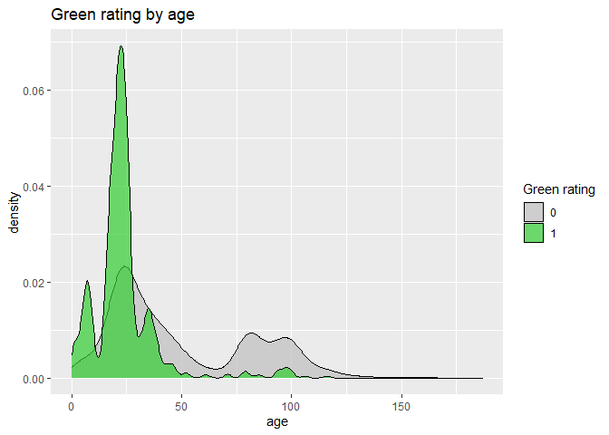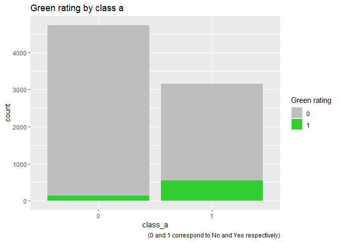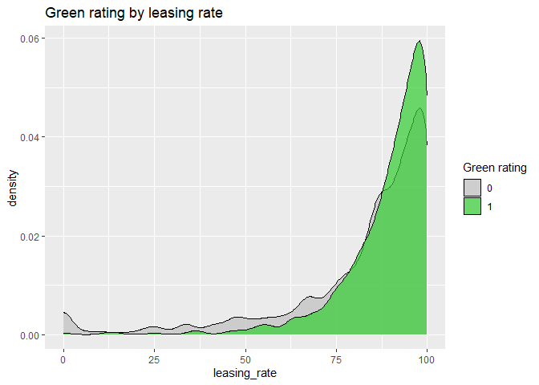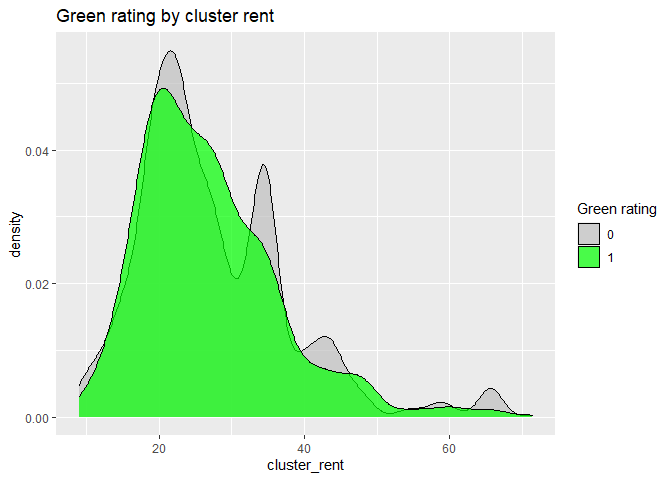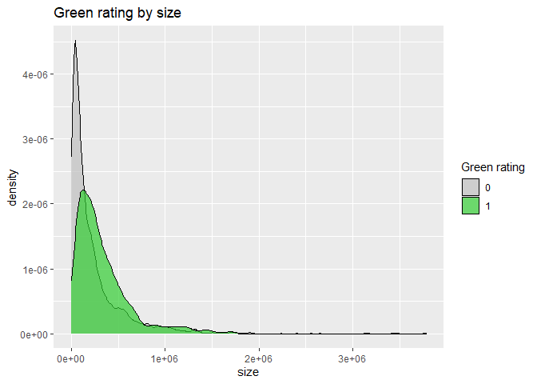

As we explored the many other variables in addition to the above graphs,
the variable *age* i.e. the age of the building in years and the
variable *class\_a* i.e. the indicator of highest quality properties
caught our attention. We could clearly see some patterns. The green
buildings are mostly young and proportion of green buildings is higher
among the class a buildings.

Going back to our original question of the confounding variable, is it
possible that the higher median rent of the green buildings was being
driven by their age (*well this would be great for the developer since
she is building a new property*)? Or is it possible that the green
buildings in our data set came out to be desirable because many belonged
to the class\_a category? Let’s find out.

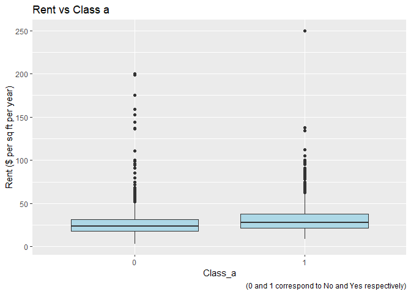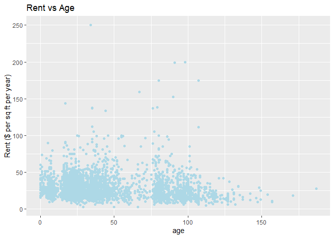

As seen from above, age and rent does not appear to have a correlation.
The class\_a indicator, however, seems to be influencing the rent. We
can see that the median rent is higher for buildings which are qualified
as class a.

Now, let’s look at the median rent values for green buildings split by
whether they belong to the class a category of buildings or not.

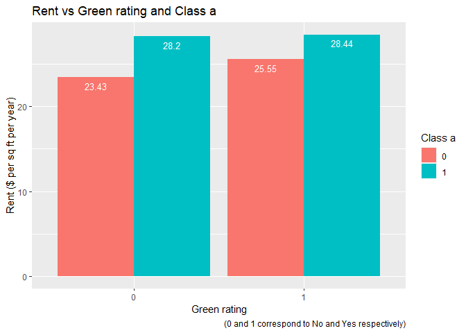

The median rent value for green buildings when they belong to the class
a category is 28.44 but only 25.55 when they don’t. Additionally, if the
developer ends up investing in green building that doesn’t belong to the
class a category, the economic benefits are tend to be lower as compared
to a class\_a, non-green building.

Now, given that the excel guru’s insight is based on the premise that
the green building will generate more revenue as compared to a non-green
building, we can clearly see from above that might not be the case
truly. The class a indicator seems to be playing a big role here.

So, our recommendation to the developer would be to invest in a green
building if it is also a class a building.

Let’s also look at the occupancy rates for these buildings:

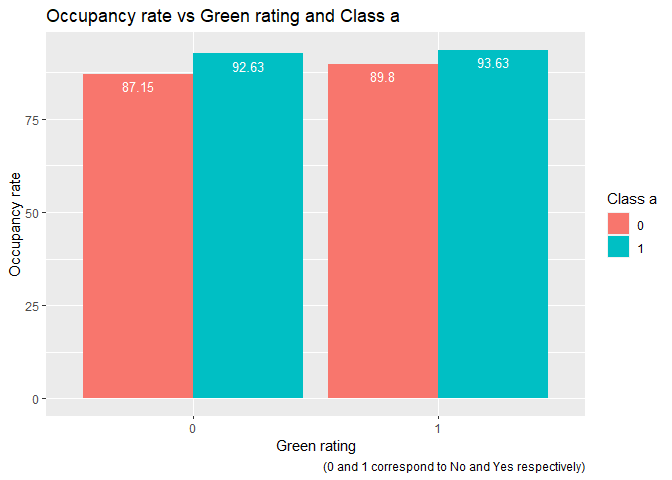

**Summarizing:**

-   We first discovered that most green buildings are young and a higher
    proportion of green buildings belong to the class a category

-   We then looked at the association of age and class a category with
    rent. Although, there was not a high correlation between age and
    rent, we could clearly see that the median rent value of class a
    buildings is higher as compared to those that aren’t class a

-   The above suggests a possibility that higher rent value of the green
    buildings as concluded by the Excel guru might not be because of
    their green certification, but rather because of their class a
    qualification

-   As we deep-dived to check the median rent values for buildings split
    by both their green certification and class a qualification, we
    discovered that median rent value of a non-class a, green building
    is lower than that of a class a, non-green building. Hence, it
    wouldn’t be wise for the real estate developer to invest into a
    green building without exploring the class status of the building

-   We also checked the occupancy rate of the buildings for this split,
    which is also higher for class a buildings

-   Considering the above points - we recommend the real estate
    developer invest in a green building only if it is also a class a
    building

# Association Rule Mining

The data contains a list of grocery purchases with each row representing
one shopping basket containing one or more grocery items. Our analysis
aims at finding interesting association rules between these items. This
is followed by a few recommendations that the grocery stores can
consider in order to leverage these discoveries and enhance the customer
experience / sales.

Let’s run the Apriori algorithm.

    ## Apriori
    ## 
    ## Parameter specification:
    ##  confidence minval smax arem  aval originalSupport maxtime support minlen
    ##         0.1    0.1    1 none FALSE            TRUE       5   0.005      1
    ##  maxlen target  ext
    ##       6  rules TRUE
    ## 
    ## Algorithmic control:
    ##  filter tree heap memopt load sort verbose
    ##     0.1 TRUE TRUE  FALSE TRUE    2    TRUE
    ## 
    ## Absolute minimum support count: 49 
    ## 
    ## set item appearances ...[0 item(s)] done [0.00s].
    ## set transactions ...[169 item(s), 9835 transaction(s)] done [0.00s].
    ## sorting and recoding items ... [120 item(s)] done [0.00s].
    ## creating transaction tree ... done [0.00s].
    ## checking subsets of size 1 2 3 4 done [0.00s].
    ## writing ... [1582 rule(s)] done [0.00s].
    ## creating S4 object  ... done [0.00s].

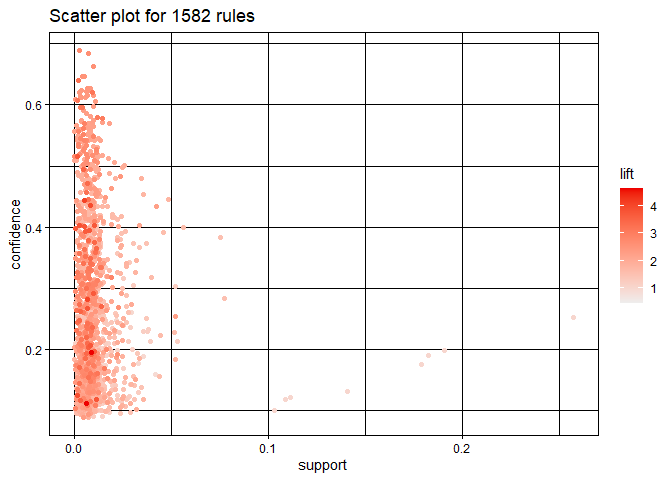

In the chart above, we can see just a few data points that fall beyond
0.05 value of support. Let’s look at these comparatively high support
associations.

**Subset of rules when support &gt; 0.05**

    ##      lhs                   rhs                support    confidence coverage 
    ## [1]  {}                 => {bottled water}    0.11052364 0.1105236  1.0000000
    ## [2]  {}                 => {tropical fruit}   0.10493137 0.1049314  1.0000000
    ## [3]  {}                 => {root vegetables}  0.10899847 0.1089985  1.0000000
    ## [4]  {}                 => {soda}             0.17437722 0.1743772  1.0000000
    ## [5]  {}                 => {yogurt}           0.13950178 0.1395018  1.0000000
    ## [6]  {}                 => {rolls/buns}       0.18393493 0.1839349  1.0000000
    ## [7]  {}                 => {other vegetables} 0.19349263 0.1934926  1.0000000
    ## [8]  {}                 => {whole milk}       0.25551601 0.2555160  1.0000000
    ## [9]  {yogurt}           => {whole milk}       0.05602440 0.4016035  0.1395018
    ## [10] {whole milk}       => {yogurt}           0.05602440 0.2192598  0.2555160
    ## [11] {rolls/buns}       => {whole milk}       0.05663447 0.3079049  0.1839349
    ## [12] {whole milk}       => {rolls/buns}       0.05663447 0.2216474  0.2555160
    ## [13] {other vegetables} => {whole milk}       0.07483477 0.3867578  0.1934926
    ## [14] {whole milk}       => {other vegetables} 0.07483477 0.2928770  0.2555160
    ##      lift     count
    ## [1]  1.000000 1087 
    ## [2]  1.000000 1032 
    ## [3]  1.000000 1072 
    ## [4]  1.000000 1715 
    ## [5]  1.000000 1372 
    ## [6]  1.000000 1809 
    ## [7]  1.000000 1903 
    ## [8]  1.000000 2513 
    ## [9]  1.571735  551 
    ## [10] 1.571735  551 
    ## [11] 1.205032  557 
    ## [12] 1.205032  557 
    ## [13] 1.513634  736 
    ## [14] 1.513634  736

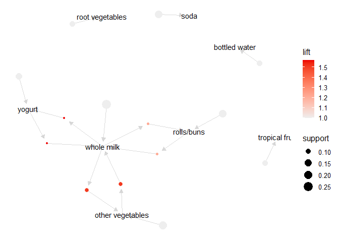

As expected, high support grocery item sets are also the popular ones.
We can see a lot of rows with empty left-hand side. Their right-hand
side contain the super popular items that are meeting our minimum
support threshold. Their confidence, however, is low as compared to the
rest of the associations because they condition on nothing but the
entire data set. Further, in the below chart (where red to green
represent low to high betweenness centrality), whole milk and vegetables
appear to have very high betweenness centrality.

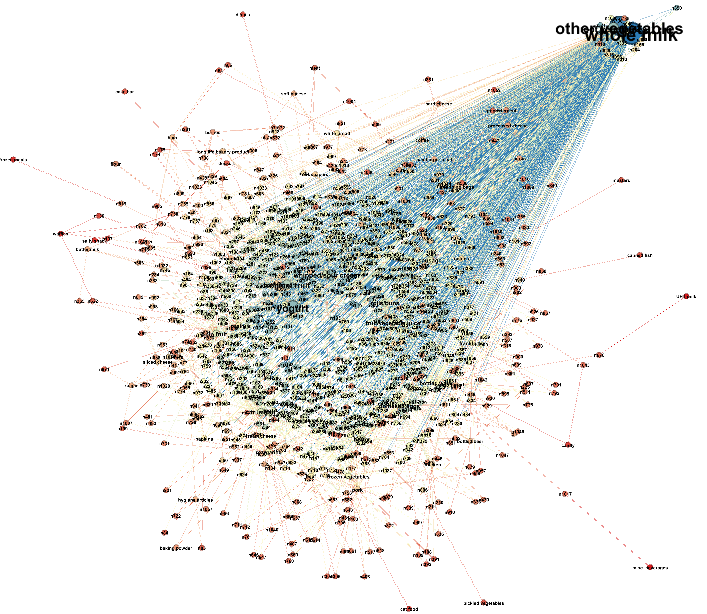

Nevertheless, aren’t milk and vegetables some things that we have in our
own baskets on most of our grocery shopping trips? So let’s explore
further to see if we can find some more interesting associations.

Again, if we look at the very first graph, there are only a few data
point whose confidence is above 0.6. Let’s check them out.

**Subset of rules when confidence &gt; 0.6**

    ##      lhs                        rhs                    support confidence    coverage     lift count
    ## [1]  {onions,                                                                                       
    ##       root vegetables}       => {other vegetables} 0.005693950  0.6021505 0.009456024 3.112008    56
    ## [2]  {curd,                                                                                         
    ##       tropical fruit}        => {whole milk}       0.006507372  0.6336634 0.010269446 2.479936    64
    ## [3]  {domestic eggs,                                                                                
    ##       margarine}             => {whole milk}       0.005185562  0.6219512 0.008337570 2.434099    51
    ## [4]  {butter,                                                                                       
    ##       domestic eggs}         => {whole milk}       0.005998983  0.6210526 0.009659380 2.430582    59
    ## [5]  {butter,                                                                                       
    ##       whipped/sour cream}    => {whole milk}       0.006710727  0.6600000 0.010167768 2.583008    66
    ## [6]  {bottled water,                                                                                
    ##       butter}                => {whole milk}       0.005388917  0.6022727 0.008947636 2.357084    53
    ## [7]  {butter,                                                                                       
    ##       tropical fruit}        => {whole milk}       0.006202339  0.6224490 0.009964413 2.436047    61
    ## [8]  {butter,                                                                                       
    ##       root vegetables}       => {whole milk}       0.008235892  0.6377953 0.012913066 2.496107    81
    ## [9]  {butter,                                                                                       
    ##       yogurt}                => {whole milk}       0.009354347  0.6388889 0.014641586 2.500387    92
    ## [10] {domestic eggs,                                                                                
    ##       pip fruit}             => {whole milk}       0.005388917  0.6235294 0.008642603 2.440275    53
    ## [11] {domestic eggs,                                                                                
    ##       tropical fruit}        => {whole milk}       0.006914082  0.6071429 0.011387900 2.376144    68
    ## [12] {pip fruit,                                                                                    
    ##       whipped/sour cream}    => {other vegetables} 0.005592272  0.6043956 0.009252669 3.123610    55
    ## [13] {pip fruit,                                                                                    
    ##       whipped/sour cream}    => {whole milk}       0.005998983  0.6483516 0.009252669 2.537421    59
    ## [14] {fruit/vegetable juice,                                                                        
    ##       other vegetables,                                                                             
    ##       yogurt}                => {whole milk}       0.005083884  0.6172840 0.008235892 2.415833    50
    ## [15] {other vegetables,                                                                             
    ##       root vegetables,                                                                              
    ##       whipped/sour cream}    => {whole milk}       0.005185562  0.6071429 0.008540925 2.376144    51
    ## [16] {other vegetables,                                                                             
    ##       pip fruit,                                                                                    
    ##       root vegetables}       => {whole milk}       0.005490595  0.6750000 0.008134215 2.641713    54
    ## [17] {pip fruit,                                                                                    
    ##       root vegetables,                                                                              
    ##       whole milk}            => {other vegetables} 0.005490595  0.6136364 0.008947636 3.171368    54
    ## [18] {other vegetables,                                                                             
    ##       pip fruit,                                                                                    
    ##       yogurt}                => {whole milk}       0.005083884  0.6250000 0.008134215 2.446031    50
    ## [19] {citrus fruit,                                                                                 
    ##       root vegetables,                                                                              
    ##       whole milk}            => {other vegetables} 0.005795628  0.6333333 0.009150991 3.273165    57
    ## [20] {root vegetables,                                                                              
    ##       tropical fruit,                                                                               
    ##       yogurt}                => {whole milk}       0.005693950  0.7000000 0.008134215 2.739554    56
    ## [21] {other vegetables,                                                                             
    ##       tropical fruit,                                                                               
    ##       yogurt}                => {whole milk}       0.007625826  0.6198347 0.012302999 2.425816    75
    ## [22] {other vegetables,                                                                             
    ##       root vegetables,                                                                              
    ##       yogurt}                => {whole milk}       0.007829181  0.6062992 0.012913066 2.372842    77

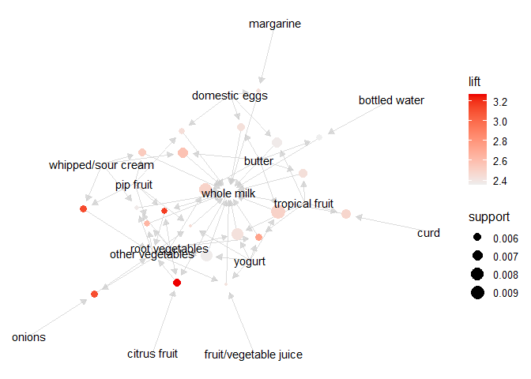

Here are some of the associations. Other vegetables appear quite often
in grocery baskets that contain root vegetables, fruits, milk etc.
Similarly, whole milk seems to be frequently present in grocery baskets
that contain vegetables, fruits, butter, cream or yogurt.

Grocery stores may consider having the dairy and vegetable sections
adjacent to each other for the ease of navigation may enhance the
customer experience. The below chart is also helpful to visualize
different clusters of our items - we can see dairy and vegetables go
together.

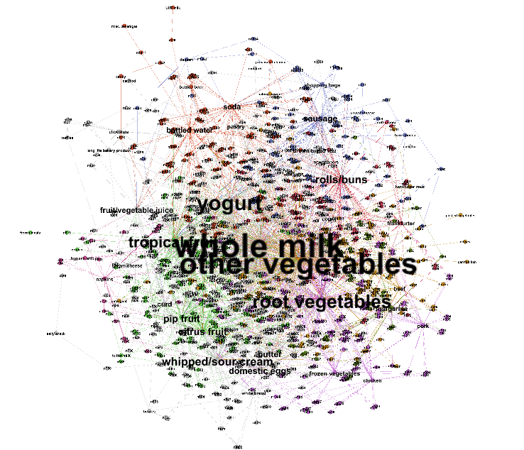

Confidence, however, is not enough to evaluate the strength of the
associations. It is also worthwhile to consider how this confidence
relates to the expected confidence (i.e. baseline occurrence) of the rhs
item, essentially the lift.

A lift of 1 would mean that the lhs and rhs item sets are independent,
essentially no association. So, we want to look at some high lift
associations. Below is again the very first graph, but with lift on the
y-axis. Only a few data points fall above 3.5 value of lift. Let’s take
a loot at these.

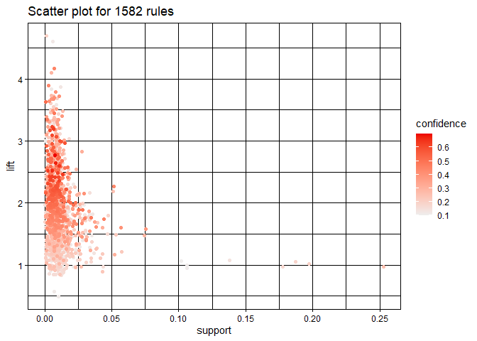

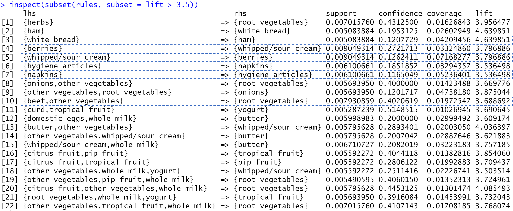

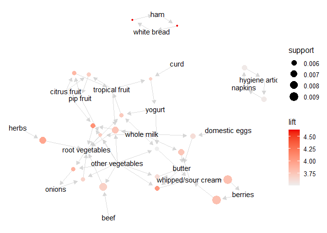

All of the above item sets appear quite infrequently in our data set.
The lift, however, is high and suggests that grocery stores maybe able
to increase the sales of these items by leveraging these association
rules.

We had earlier suggested that grocery stores may consider having the
dairy and vegetable sections alongside each other for the convenience of
the customers. Here are some more recommendations based on the high lift
associations we just saw:

-   Berries can be put alongside whipped/sour cream in the stores as
    their likelihood to be purchased with whipped/sour cream is about
    3.8 times higher as compared to their baseline likelihood of being
    bought. Strawberries with whipped cream - people surely have a good
    taste!

-   Ham is more likely to be purchased along with the white bread.
    Grocery stores can have them on display together along with
    advertisement posters of a recipe that include them. It is also
    interesting that root vegetables are more likely to be purchased
    with beef. Something similar could be done with these as well

-   Napkins and hygiene products can be made available for some combo
    discounts
