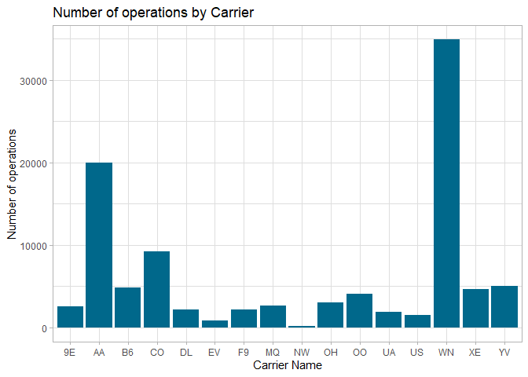
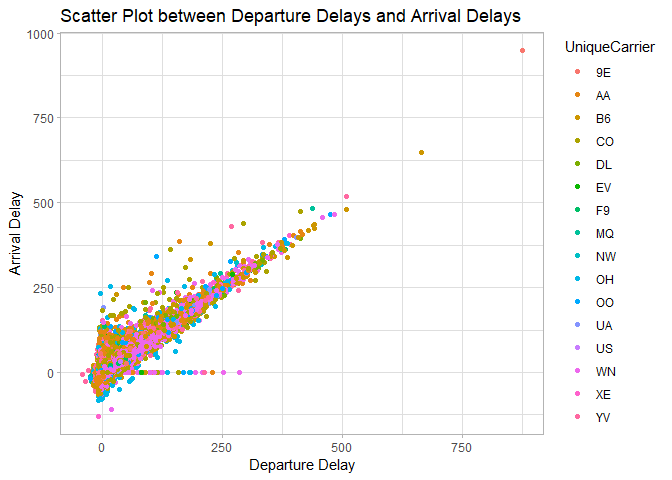
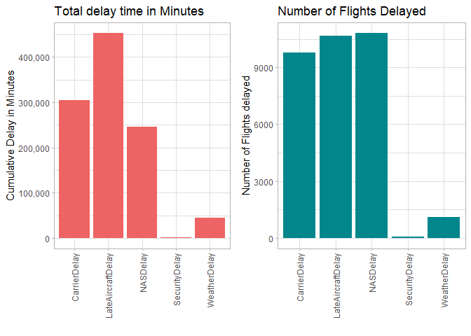
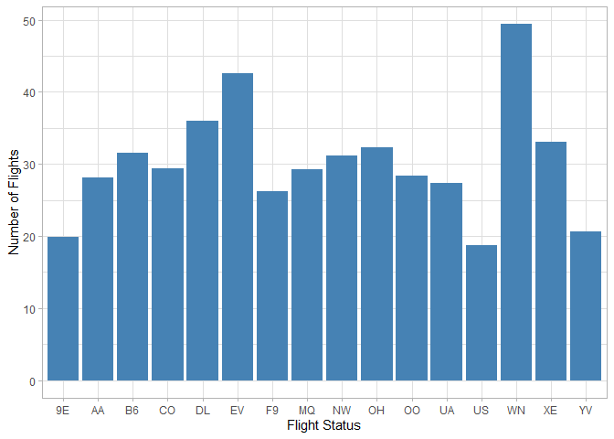

**Visual story telling: flights at ABIA**
-----------------------------------------

### **Problem**

Consider the data in ABIA.csv, which contains information on every
commercial flight in 2008 that either departed from or landed at
Austin-Bergstrom Interational Airport.

Your task is to create a figure, or set of related figures, that tell an
interesting story about flights into and out of Austin. You can annotate
the figure and briefly describe it, but strive to make it as stand-alone
as possible. It shouldn’t need many, many paragraphs to convey its
meaning. Rather, the figure should speak for itself as far as possible.

### **Objectives**

-   ***Data Introduction and Volumes***

    -   Volume of Delayed, Cancelled, Ontime Flights
    -   Volume of Flights by Carrier Operation
    -   Volume of Flights by Destination

-   ***Analysis of Delays and Cancellations***

    -   Distribution of Delay time by Arrivals and Departures.
    -   Correlation between Arrival Delay and Departure Delay
    -   Reasons for Delay
    -   Delays impact by Destination

-   ***Carrier Analysis***

    -   Volume of Flights Delayed / Cancelled by Carrier Operation
    -   Percentage Delay by substantial Carriers.

### **Data Introduction and Volumes**

<h4>
Volume of Flights by Delayed, Ontime, Cancelled
</h4>

<b> Observations : </b> Surprisingly, nearly 50% of flights seem to be
delayed (Either Arrival or Departure). This however does not tell the
full story as we include flights that are delayed by even 1 minute. As
we analyse delay further later, the information becomes more valid.

<h4>
Volume of Flights by Carrier
</h4>

<b> Observations : </b> Southwest(WN) tops the list with almost 40k
operations, followed by Alaskan Airlines(AA). Northwest Airlines(NW) has
the fewest operations with just 121.

<b> Observations : </b> We see that most flights are within state incase
of both Outbound and Inboud from ABIA. Interms of Out-Of-State flights,
we see maximam flights with California.

### ***Analysis of Delays and Cancellations***

Now that we have an overview of the data, we focus on delays.

<h4>
Distribution of Delay time by Arrivals and Departures
</h4>

<b> Observations : </b> Both Delay at departure and delat at arrival are
centered at 0. As expected most flight take off and arrive on time.
There are some major outliers.

<h4>
Correlation between Arrival Delay and Departure Delay
</h4>

<b> Observations : </b> As expected, most flights that depart late,
arrive late. However, there are several flights, that although Depart
late are able to Arrive on time.

<h4>
Reasons for Delay
</h4>

<b> Observations </b> : Maximum number of flighs are delayed due to
NASDelay, however, they do not result in maximum amount of delay.
Carrier delay seems to be most time expensive although slightly less
frequent.

<h4>
Delay by Destination
</h4>

<b> Note : </b> All delays are aggregated then normalized by number of
flights. To maintain scale we have log transformed the delays, to habdle
states that had just one flight.

<b> Observation : </b>

-   Maximum departure delay is seen at ABIA airport when flights are
    departing for the Des Moines Internainal Airport, Iowa.
-   Maximum Arrival delay is seen for Inbound flights to ABIA airport
    when arriving from Dulles International Airport, Virginia

### ***Analysis of Carriers and How they perform in terms of Delay***

<h4>
Delay by Carriers
</h4>

<b> Observations : </b> We see that most flights carriers maintain a
ontime/delayed &gt;1 ratio. This is indicative of volume proportion. In
the below graph we see the percentage of flights that are delayed by
each carrier.

<h4>
Percentage delay by Carriers
</h4>

<b> Observation : </b> Southwest Airlines (WN), EVA Air(EV) and Delta
airlines(DL) had maximum percentage of flights delayed in 2008,while US
Airways (US),Endeavor Air(9E) and Mesa Airlines (YV) had least
percentage of flights delayed.
