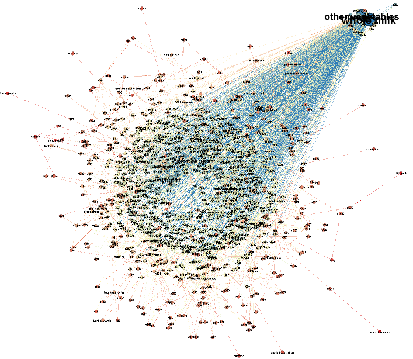
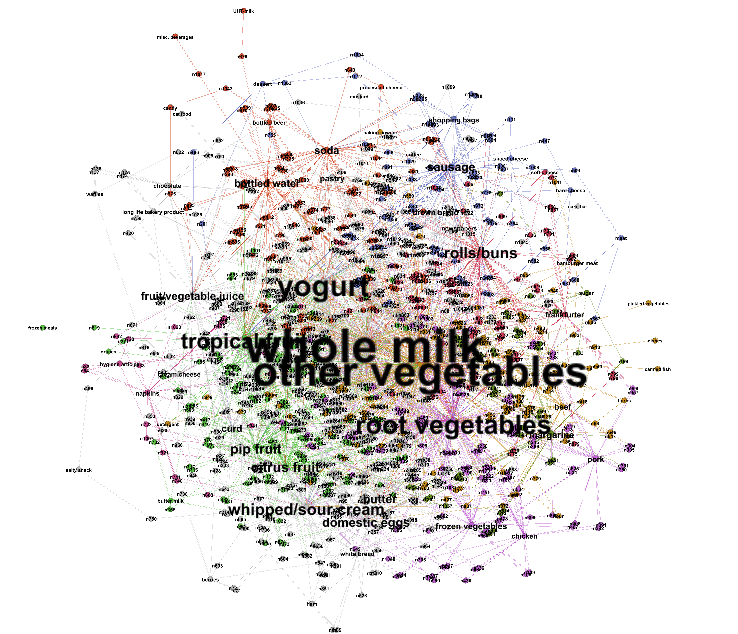
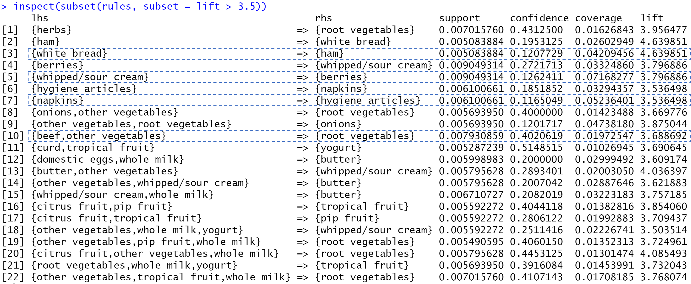

Link to RMD file: https://github.com/its-safi/STA380_EXAM_2

```{r setup, include=FALSE}
knitr::opts_chunk$set(echo = TRUE)
```

# Problem 1: Visual story telling part 1: green buildings
The real estate developer essentially wants to know if investing in a green building would be worth it, in terms of economic benefits. And while on the first glance it made sense that the Excel guru computed the expected revenue using the median rent values for green buildings, it could not be that straightforward, can it? Maybe - it is possible that the higher rent values in green building is due to them being green, but it is also possible that it is there due to some other attribute that is correlated with green buildings. In case of the latter, it is essential to explore this confounding attribute in order to provide the right recommendation to the developer.

Let's explore some variables to see if they have a relationship with the green ratings

```{r, echo=FALSE,message=FALSE}
library(tidyverse)

greenbuildingdata <- read.csv(file = 'Data/greenbuildings.csv', sep=",")


ggplot(greenbuildingdata, aes(x=age, fill=as.factor(green_rating))) +
  geom_density(alpha=0.7) +
  guides(fill=guide_legend(title="Green rating"))+ 
  scale_fill_manual(values=c("grey", "limegreen")) + 
  labs(title = "Green rating by age")

ggplot(greenbuildingdata, aes(x=as.factor(class_a), fill=as.factor(green_rating))) +
  geom_bar() +
  guides(fill=guide_legend(title="Green rating")) + 
  scale_fill_manual(values=c("grey", "limegreen")) + xlab("class_a") +
  labs(caption = "(0 and 1 correspond to No and Yes respectively)", title ="Green rating by class a")

ggplot(greenbuildingdata, aes(x=leasing_rate, fill=as.factor(green_rating))) +
  geom_density(alpha=0.7) +
  guides(fill=guide_legend(title="Green rating"))+ 
  scale_fill_manual(values=c("grey", "limegreen"))+ 
  labs(title = "Green rating by leasing rate")

ggplot(greenbuildingdata, aes(x=cluster_rent, fill=as.factor(green_rating))) +
  geom_density(alpha=0.7) +
  guides(fill=guide_legend(title="Green rating"))+ 
  scale_fill_manual(values=c("grey", "green"))+ 
  labs(title = "Green rating by cluster rent")

ggplot(greenbuildingdata, aes(x=size, fill=as.factor(green_rating))) +
  geom_density(alpha=0.7) +
  guides(fill=guide_legend(title="Green rating"))+ 
  scale_fill_manual(values=c("grey", "limegreen"))+ 
  labs(title = "Green rating by size")
```

As we explored the many other variables in addition to the above graphs, the variable *age* i.e. the age of the building in years and the variable *class_a* i.e. the indicator of highest quality properties caught our attention. We could clearly see some patterns. The green buildings are mostly young and proportion of green buildings is higher among the class a buildings. 

Going back to our original question of the confounding variable, is it possible that the higher median rent of the green buildings was being driven by their age (*well this would be great for the developer since she is building a new property*)? Or is it possible that the green buildings in our data set came out to be desirable because many belonged to the class_a category? Let's find out. 

```{r, echo=FALSE,message=FALSE}
ggplot(greenbuildingdata, aes(x=as.factor(class_a), y=Rent, fill="lightblue")) +
  geom_boxplot() + 
  scale_fill_manual(values=c("lightblue")) +
  theme(legend.position = "none") + xlab("Class_a") +
  labs(caption = "(0 and 1 correspond to No and Yes respectively)")+ ylab("Rent ($ per sq ft per year)")+ 
  labs(title = "Rent vs Class a")

ggplot(greenbuildingdata, aes(x=age, y=Rent,color="blue")) +
  geom_point() +
  scale_color_manual(values=c("lightblue")) +
  theme(legend.position = "none")+ ylab("Rent ($ per sq ft per year)")+ 
  labs(title = "Rent vs Age")

```

As seen from above, age and rent does not appear to have a correlation. The class_a indicator, however, seems to be influencing the rent. We can see that the median rent is higher for buildings which are qualified as class a. 

Now, let's look at the median rent values for green buildings split by whether they belong to the class a category of buildings or not.

```{r, echo=FALSE,message=FALSE}

library(dplyr)
df <- greenbuildingdata %>% 
  group_by(class_a,green_rating) %>% 
  summarise(Rent = median(Rent))


ggplot(df, aes(x=as.factor(green_rating), y=Rent,fill=as.factor(class_a))) +
  geom_bar(stat="identity", position=position_dodge()) +
  geom_text(aes(label=round(Rent, digits=2)), vjust=1.6,position = position_dodge(0.9), color="white", size=3.5) + xlab("Green rating") +
  labs(caption = "(0 and 1 correspond to No and Yes respectively)", title = "Rent vs Green rating and Class a") +
  guides(fill=guide_legend(title="Class a"))+ ylab("Rent ($ per sq ft per year)")


```

The median rent value for green buildings when they belong to the class a category is 28.44 but only 25.55 when they don't. Additionally, if the developer ends up investing in green building that doesn't belong to the class a category, the economic benefits are tend to be lower as compared to a class_a, non-green building. 

Now, given that the excel guru's insight is based on the premise that the green building will generate more revenue as compared to a non-green building, we can clearly see from above that might not be the case truly. The class a indicator seems to be playing a big role here. 

So, our recommendation to the developer would be to invest in a green building if it is also a class a building. 

Let's also look at the occupancy rates for these buildings:

```{r, echo=FALSE,message=FALSE}

df <- greenbuildingdata %>% 
  group_by(class_a,green_rating) %>% 
  summarise(Occupancy = median(leasing_rate))
ggplot(df, aes(x=as.factor(green_rating), y=Occupancy,fill=as.factor(class_a))) +
  geom_bar(stat="identity", position=position_dodge()) +
  geom_text(aes(label=round(Occupancy, digits=2)), vjust=1.6,position = position_dodge(0.9), color="white", size=3.5)+ xlab("Green rating") +
  labs(caption = "(0 and 1 correspond to No and Yes respectively)", title="Occupancy rate vs Green rating and Class a") +
  guides(fill=guide_legend(title="Class a")) + ylab("Occupancy rate")

```


**Summarizing:**

* We first discovered that most green buildings are young and a higher proportion of green buildings belong to the class a category

* We then looked at the association of age and class a category with rent. Although, there was not a high correlation between age and rent, we could clearly see that the median rent value of class a buildings is higher as compared to those that aren't class a

* The above suggests a possibility that higher rent value of the green buildings as concluded by the Excel guru might not be because of their green certification, but rather because of their class a qualification

* As we deep-dived to check the median rent values for buildings split by both their green certification and class a qualification, we discovered that median rent value of a non-class a, green building is lower than that of a class a, non-green building. Hence, it wouldn't be wise for the real estate developer to invest into a green building without exploring the class status of the building 

* We also checked the occupancy rate of the buildings for this split, which is also higher for class a buildings

* Considering the above points - we recommend the real estate developer invest in a green building only if it is also a class a building


# Problem 2: Visual story telling: flights at ABIA

### **Problem**
Consider the data in ABIA.csv, which contains information on every commercial flight in 2008 that either departed from or landed at Austin-Bergstrom Interational Airport. 

Your task is to create a figure, or set of related figures, that tell an interesting story about flights into and out of Austin. You can annotate the figure and briefly describe it, but strive to make it as stand-alone as possible. It shouldn't need many, many paragraphs to convey its meaning. Rather, the figure should speak for itself as far as possible.


### **Objectives**
* ***Data Introduction and Volumes***

    * Volume of Delayed, Cancelled, Ontime Flights
    * Volume of Flights by Carrier Operation
    * Volume of Flights by Destination
    
    
* ***Analysis of Delays and Cancellations***
    * Distribution of Delay time by Arrivals and Departures. 
    * Correlation between Arrival Delay and Departure Delay
    * Reasons for Delay
    * Delays impact by Destination
    
* ***Carrier Analysis***
    * Volume of Flights Delayed / Cancelled by Carrier Operation
    * Percentage Delay by substantial Carriers.
    


### **Data Introduction and Volumes**


```{r, echo=FALSE, include=FALSE}
library(ggplot2)
library(ggpubr)
library(tidyverse)
library(hrbrthemes)
library(viridis)
library(ggridges)
airport.data <- read.csv("Data/ABIA.csv", header = TRUE) 
head(airport.data)
attach(airport.data)
colSums(is.na(airport.data))
```

```{r, echo=FALSE, include=FALSE}

colnames(airport.data)
dim(airport.data)

```

```{r, echo=FALSE, include=FALSE}

airport.data[is.na(airport.data)] <- 0
colSums(is.na(airport.data))

airport.data$Delayed <- ifelse(airport.data$DepDelay+airport.data$ArrDelay  > 0 , TRUE , FALSE)

#Declare as Factors
col_factors <- c('Month', 'DayofMonth', 'DayOfWeek', 'Cancelled', 'Diverted')
airport.data[,col_factors] <- lapply(airport.data[,col_factors], as.factor)

#Get hour from hhmm format.
airport.data$Dep_Hr <- sapply(DepTime, function(x) x%/%100)
airport.data$CRSDep_Hr <- sapply(CRSDepTime, function(x) x%/%100)
airport.data$Arr_Hr <- sapply(ArrTime, function(x) x%/%100)
airport.data$CRSArr_Hr <- sapply(CRSArrTime, function(x) x%/%100)

aus.dep <- subset(airport.data, Origin == 'AUS') #Divide data into arrival and Departure subsets
aus.arr <- subset(airport.data, Dest == 'AUS')

```


<h4> Volume of Flights by Delayed, Ontime, Cancelled </h4>

```{r, echo=FALSE}
cancelled_flights=nrow(airport.data[airport.data$Cancelled == 1,])
delayed_flights=nrow(airport.data[airport.data$Delayed == TRUE & airport.data$Cancelled == 0,])
ontime_flights=nrow(airport.data[airport.data$Delayed == FALSE & airport.data$Cancelled == 0,])


flight_categories <- c('Cancelled Flights','Delayed Flights','Ontime Flights')
flight_counts_categories <- c(cancelled_flights, delayed_flights, ontime_flights)

flight_stat_data <- data.frame(flight_categories, flight_counts_categories)

df <- data.frame(flight_categories=c('Cancelled Flights','Delayed Flights','Ontime Flights'),
                flight_counts_categories=c(cancelled_flights, delayed_flights, ontime_flights))
p<-ggplot(data=df, aes(x=flight_categories, y=flight_counts_categories)) +
  geom_bar(stat="identity", fill="steelblue")+
   theme_light()  +
  xlab('Flight Status') +
  ylab('Number of Flights')
p


```

<b> Observations : </b> Surprisingly, nearly 50% of flights seem to be delayed (Either Arrival or Departure). This however does not tell the full story as we include flights that are delayed by even 1 minute. As we analyse delay further later, the information becomes more valid. 


<h4> Volume of Flights by Carrier </h4>

```{r, echo=FALSE, include=TRUE}
pl <- ggplot(aes(x=UniqueCarrier), data=airport.data) +
  geom_bar(fill='deepskyblue4', position='dodge') +
  ggtitle('Number of operations by Carrier') +
  xlab('Carrier Name') +
  ylab('Number of operations')+ theme_light() 
  

pl

```

<b> Observations : </b> Southwest(WN) tops the list with almost 40k operations, followed by Alaskan Airlines(AA). Northwest Airlines(NW) has the fewest operations with just 121. 

```{r, echo=FALSE, include=TRUE, message=FALSE}
packages = c("gtrendsR","tidyverse","usmap")

#use this function to check if each package is on the local machine
#if a package is installed, it will be loaded
#if any are not, the missing package(s) will be installed and loaded
package.check <- lapply(packages, FUN = function(x) {
    if (!require(x, character.only = TRUE)) {
        install.packages(x, dependencies = TRUE)
        library(x, character.only = TRUE)
    }
})


orange <- "#F88379"

aus_lat_long <- aus.dep[ , c("Dest", "DepDelay")] 
airport_codes = read.csv("Data/AIRPORTCODES_FILLED.csv")

aus_dep_lat_long <- merge(x = aus_lat_long, y = airport_codes, by.x="Dest", by.y="ï..CODE", all.x = TRUE)


require(dplyr)
ch_dep <- aus_dep_lat_long %>% count(FIPS.code)

colnames(ch_dep)[1]='fips'
colnames(ch_dep)[2]='hits'

plot_usmap(data = ch_dep, values = "hits",  color = orange, labels=FALSE) + 
  scale_fill_continuous( low = "white", high = orange, 
                         name = "Volume of Flights - Outgoing from ABIA", label = scales::comma
  ) + 
  theme(legend.position = "right") + 
  theme(panel.background = element_rect(colour = "black"))+labs(title = "Volume of Flights - Outbound from ABIA", caption = "Total Delay in minutes/Number of journeys") 


#Arrival delay 
orange <- "#4682B4"

aus_lat_long <- aus.arr[ , c("Origin", "DepDelay")] 
airport_codes = read.csv("Data/AIRPORTCODES_FILLED.csv")

aus_dep_lat_long <- merge(x = aus_lat_long, y = airport_codes, by.x="Origin", by.y="ï..CODE", all.x = TRUE)


require(dplyr)
ch <- aus_dep_lat_long %>% count(FIPS.code)

colnames(ch)[1]='fips'
colnames(ch)[2]='hits'

plot_usmap(data = ch, values = "hits",  color = orange, labels=FALSE) + 
  scale_fill_continuous( low = "white", high = orange, 
                         name = "Volume of Departure", label = scales::comma
  ) + 
  theme(legend.position = "right") + 
  theme(panel.background = element_rect(colour = "black"))+labs(title = "Volume of Flights - Inbound from ABIA", caption = "Total Delay in minutes/Number of journeys") 


```

<b> Observations : </b> We see that most flights are within state incase of both Outbound and Inboud from ABIA. Interms of Out-Of-State flights, we see maximam flights flying between California and Austin. 


### ***Analysis of Delays and Cancellations***
Now that we have an overview of the data, we focus on delays. 

<h4> Distribution of Delay time by Arrivals and Departures</h4>


```{r, echo=FALSE ,  message=FALSE }
library(cowplot)

data2 <- data.frame(
  delaymins =c( aus.arr$ArrDelay, aus.dep$DepDelay),
  delaytype =c( rep("Arrival Delay",length(aus.arr$ArrDelay)), rep("Departure Delay",length(aus.dep$DepDelay)) )
)

ridges <- ggplot(data2, aes(x = delaymins, y = delaytype, fill = delaytype)) +
  geom_density_ridges() +
  theme_ridges() + 
  xlab('Delay Type') +
  ylab('Delay Duration in Minutes') +
  theme(legend.position = "none")

hist_arr_delay <- ggplot(data = airport.data, aes(x=ArrDelay)) + theme_light() +
  geom_histogram(bins = 100, binwidth = 10, fill = "turquoise4") + 
  xlab('Arrival Delay') +
  ylab('Number of Flights') +
  ggtitle('Distribution of Arrival Delays')
  

hist_dep_delay <- ggplot(data = airport.data, aes(x=DepDelay)) + theme_light() +
  geom_histogram(bins = 100, binwidth = 10, fill='indianred2') +
  xlab('Departure Delay') +
  ylab('') +
  ggtitle('Distribution of Departure Delays') 

bottomrow <- plot_grid(hist_arr_delay, hist_dep_delay)

plot_grid(
  ridges, bottomrow,
   ncol = 1, rel_heights=c(2,1)
)
```

<b> Observations : </b> Both Delay at departure and delat at arrival are centered at 0. As expected most flight take off and arrive on time.  There are some major outliers.


<h4> Correlation between Arrival Delay and Departure Delay </h4>


```{r, echo=FALSE}

pl <- ggplot(aes(x=DepDelay, y=ArrDelay), data=airport.data) +
  geom_point(aes(color=UniqueCarrier)) + theme_light() +
        ggtitle('Scatter Plot between Departure Delays and Arrival Delays') +
        xlab('Departure Delay') +
        ylab('Arrival Delay')

plot_grid(
  pl, ncol = 1
)

```

<b> Observations : </b> As expected, most flights that depart late, arrive late. However, there are several flights, that although Depart late are able to Arrive on time.


<h4> Reasons for Delay </h4>


```{r, echo=FALSE , message=FALSE}

require(scales)

CarrierDelay[is.na(CarrierDelay)] <- 0
WeatherDelay[is.na(WeatherDelay)] <- 0
NASDelay[is.na(NASDelay)] <- 0
SecurityDelay[is.na(SecurityDelay)] <- 0
LateAircraftDelay[is.na(LateAircraftDelay)] <- 0

delays = data.frame(row.names = c('CarrierDelay', 'WeatherDelay', 'NASDelay', 'SecurityDelay', 'LateAircraftDelay'),  
'Total'=c(sum(CarrierDelay), sum(WeatherDelay), sum(NASDelay), sum(SecurityDelay), sum(LateAircraftDelay)))

delay_count = c(sum(CarrierDelay>0), sum(WeatherDelay>0), sum(NASDelay>0), sum(SecurityDelay>0), sum(LateAircraftDelay>0))
delays$delay_count <- delay_count

total_number_minutes <- ggplot(delays, aes(x=rownames(delays), y=Total)) +
  geom_bar(stat = 'identity', fill = 'indianred2') +
  ggtitle('Total delay time in Minutes') + xlab('')+ theme_light() +
  ylab('Cumulative Delay in Minutes')+ theme(axis.text.x = element_text(angle = 90, vjust = 0.5, hjust=1))+ scale_y_continuous(labels = scales::comma)

total_number_flights <- ggplot(delays, aes(x=rownames(delays), y=delay_count)) +
  geom_bar(stat = 'identity', fill = 'turquoise4') +
  ggtitle('Number of Flights Delayed') + xlab('')+  theme_light() +
  ylab('Number of Flights delayed')+ theme(axis.text.x = element_text(angle = 90, vjust = 0.5, hjust=1))


plot_grid(
  total_number_minutes,total_number_flights , ncol = 2
)

```

<b> Observations </b>  : Maximum number of flighs are delayed due to NASDelay, however, they do not result in maximum amount of delay. LateAircraft delay seems to be most time expensive although slightly less frequent. 


<h4> Delay by Destination </h4>
```{r, echo=FALSE, include=TRUE}
packages = c("gtrendsR","tidyverse","usmap")

#use this function to check if each package is on the local machine
#if a package is installed, it will be loaded
#if any are not, the missing package(s) will be installed and loaded
package.check <- lapply(packages, FUN = function(x) {
    if (!require(x, character.only = TRUE)) {
        install.packages(x, dependencies = TRUE)
        library(x, character.only = TRUE)
    }
})


orange <- "#F88379"
aus_lat_long <- aus.dep[ , c("Dest", "DepDelay")] 
airport_codes = read.csv("Data/AIRPORTCODES_FILLED.csv")
aus_dep_lat_long <- merge(x = aus_lat_long, y = airport_codes, by.x="Dest", by.y="ï..CODE", all.x = TRUE)
aggregate_delays_across_states<-aggregate(aus_dep_lat_long$DepDelay , by=list(fips=aus_dep_lat_long$FIPS.code), FUN=sum)

require(dplyr)
ch <- aus_dep_lat_long %>% count(FIPS.code)
aggregate_delays_across_states_normalized <- merge(x = aggregate_delays_across_states, y = ch, by.x='fips', by.y="FIPS.code", all.x = TRUE)
agg_del <- transform(aggregate_delays_across_states_normalized, hits = x / n)
agg_del <- agg_del[ , c("fips", "hits")] 
agg_del$hits=log(abs(agg_del$hits))
plot_usmap(data = agg_del, values = "hits",  color = orange, labels=FALSE) + 
  scale_fill_continuous( low = "white", high = orange, 
                         name = "Log(Total Delay(State)/Total flights(State)", label = scales::comma
  ) + 
  theme(legend.position = "right") + 
  theme(panel.background = element_rect(colour = "black"))+labs(title = "Normalized Departure Delay by State", caption = "Total Delay in minutes/Number of journeys") 
#Arrival delay 
orange <- "#4682B4"
aus_lat_long <- aus.arr[ , c("Origin", "ArrDelay")] 
airport_codes = read.csv("Data/AIRPORTCODES_FILLED.csv")
aus_dep_lat_long <- merge(x = aus_lat_long, y = airport_codes, by.x="Origin", by.y="ï..CODE", all.x = TRUE)
aggregate_delays_across_states<-aggregate(aus_dep_lat_long$ArrDelay , by=list(fips=aus_dep_lat_long$FIPS.code), FUN=sum)

require(dplyr)
ch_arr <- aus_dep_lat_long %>% count(FIPS.code)
aggregate_delays_across_states_normalized <- merge(x = aggregate_delays_across_states, y = ch_arr, by.x='fips', by.y="FIPS.code", all.x = TRUE)
agg_del_arr <- transform(aggregate_delays_across_states_normalized, hits = x / n)
agg_del_arr <- agg_del_arr[ , c("fips", "hits")] 
agg_del_arr$hits=log(abs(agg_del_arr$hits))
plot_usmap(data = agg_del_arr, values = "hits",  color = orange, labels=FALSE) + 
  scale_fill_continuous( low = "white", high = orange, 
                         name = "Log(Total Delay(State)/Total flights(State)", label = scales::comma
  ) + 
  theme(legend.position = "right") + 
  theme(panel.background = element_rect(colour = "black"))+labs(title = "Normalized Departure Delay by State", caption = "Total Delay in minutes/Number of journeys") 

```


<b> Note : </b> All delays are aggregated then normalized by number of flights. To maintain scale we have log transformed the delays, to habdle states that had just one flight. 

<b> Observation : </b> 

* Maximum departure delay is seen at ABIA airport when flights are departing for the Des Moines Internainal Airport, Iowa. 
* Maximum Arrival delay is seen for Inbound flights to ABIA airport when arriving from Dulles International Airport, Virginia


### ***Analysis of Carriers and How they perform in terms of Delay***

<h4> Delay by Carriers </h4>

```{r, echo=FALSE}
# DABIA = subset(ABIA, ABIA$delay_bin!=is.null)
ggplot(data=na.omit(airport.data), mapping=aes(x=UniqueCarrier, y=..count.., fill=Delayed, group=Delayed)) +
  geom_bar(position = position_dodge(), color='black') +
  ggtitle("Volume of Flights Delayed/Ontime ")+ theme_light() 


```

<b> Observations : </b> We see that most flights carriers maintain a  ontime/delayed >1  ratio. This is indicative of volume proportion. In the below graph we see the percentage of flights that are delayed by each carrier. 

<h4> Percentage delay by Carriers </h4>
```{r, echo=FALSE, include=TRUE}

airport.data$dummy <- 1

#Subsetting all flights flying out of Austin
outbound_Aus <- subset(airport.data, airport.data$Origin == "AUS")

#Subsetting all flights flying out of Austin and have experienced delays
outbound_Aus_delay <- subset(airport.data, airport.data$Origin == "AUS" & airport.data$DepDelay > 0)


carrier.delay <- aggregate(outbound_Aus_delay$dummy,by=list(outbound_Aus_delay$UniqueCarrier),FUN = sum, na.rm=TRUE)
names(carrier.delay)[1] <- "UniqueCarrier"
names(carrier.delay)[2] <- "AnnualDelays"

#Airlines total outbound count
carrier.total <- aggregate(outbound_Aus$dummy,by=list(outbound_Aus$UniqueCarrier),FUN = sum, na.rm=TRUE)
names(carrier.total)[1] <- "UniqueCarrier"
names(carrier.total)[2] <- "AnnualFlights"

carrier.delay.perc <- merge(carrier.total,carrier.delay, by = "UniqueCarrier")
carrier.delay.perc$per.delays <- round(carrier.delay.perc$AnnualDelays/carrier.delay.perc$AnnualFlights,3)*100

p<-ggplot(data=carrier.delay.perc, aes(x=UniqueCarrier, y=per.delays)) +
  geom_bar(stat="identity", fill="steelblue")+
   theme_light()  +
  xlab('Flight Status') +
  ylab('Number of Flights')
p

```

<b> Observation : </b> Southwest Airlines (WN), EVA Air(EV) and Delta airlines(DL) had maximum percentage of flights delayed in 2008,while US Airways (US),Endeavor Air(9E) and Mesa Airlines (YV) had least percentage of flights delayed.


# Problem 3: Portfolio Modelling
### **Problem Statement**
Construct three different portfolios of exchange-traded funds (ETFs), and use bootstrap resampling to analyze the short-term tail risk of the portfolios

```{r, echo=FALSE, include=FALSE}
library(ggstance)
library(mosaic)
library(quantmod)
library(foreach)
library(ggplot2)
library(GGally)
library(tidyverse)
library(tidyquant)  
library(cowplot)
```
### **Solution**
We have selected ETFs that vary accross different levels of risk to create three versatile portfolios. 

We will be looking at the ETFs **"QQQ", "VUG", "IWF", "USMV","YYY and "SPLV"** and have divided the risk levels of the ETFs into 
    
  * High risk ETFs : **QQQ, VUG, IWF**
  * Low risk ETFs : **USMV, YYY and SPLV**
  
A high-risk ETF is one for which there is either a large percentage chance of loss of capital or under-performance—or a relatively high chance of a devastating loss. However, it may have chances of providing very high returns. 

A low-risk ETF has less at stake in terms of the amount invested or the significance of the investment to the portfolio

We will be considering 5 years of ETF data starting from 05-29-2015 to build our portfolios.

```{r, echo=FALSE, include=FALSE}
# Import stocks
mystocks = c("QQQ","VUG","IWF","USMV","YYY","SPLV")

# Getting price data for 5 years
getSymbols(mystocks, from='2015-05-29')

#Adjusting for splits and dividends
for(ticker in mystocks){
  expr = paste0(ticker, "a=adjustOHLC(", ticker, ")")
  eval(parse(text=expr))
}
```

Sample Data for QQQ (High risk ETF)
```{r, echo=FALSE}
tail(QQQa,3)
```
Sample Data for YYY (Low risk ETF)
```{r, echo=FALSE}
tail(YYYa,3)
```

```{r, echo=FALSE, include=FALSE}
# Combining all the returns in a matrix
all_returns = cbind( ClCl(QQQa),
                     ClCl(VUGa),
                     ClCl(IWFa),
                     ClCl(USMVa),
                     ClCl(YYYa),
                     ClCl(SPLVa))

# Removing all the NAs
all_returns = as.matrix(na.omit(all_returns))
head(all_returns)
```


By computing the correlation between the stocks, we can be observe that the relationship is non-linear and there is no fixed pattern. Some stocks are performing well, while some are not performing well. 


```{r,fig.align='center',out.extra='angle=90', echo=FALSE}
# checking the correlation between stocks

pairs(all_returns,
      lower.panel = panel.smooth, 
      col = "cornflowerblue",
      pch = 19,                                                
      cex = 0.8,                                            
      labels = c("QQQ","VUG","IWF","USMV","YYY","SPLV"),  
      gap = 0.3,
      main = "Correlation between all stocks")


#pairs(all_returns)
```


```{r,fig.align='center',out.extra='angle=90', echo=FALSE}
# Close to close changes of the stocks in the five year period

#plot(ClCl(QQQa), type = 'l')
#plot(ClCl(VUGa), type='l')
#plot(ClCl(IWFa), type='l')
#plot(ClCl(USMVa), type='l')
#plot(ClCl(YYYa), type='l')
#plot(ClCl(SPLVa), type='l')
```

```{r, echo=FALSE, include=FALSE}
initial_wealth = 100000
```

The initial wealth given to us is $100,000. We will look at three different portfolio models. 
    
  * Model 1 : **Low-risk Portfolio**
  * Model 2 : **High risk Portfolio** 
  * Model 3 : **Mixed Portfolio**

#### **Model 1 : Low-risk Portfolio**

For the low-risk portfolio, we will distribute 60% of the total wealth among the low risk ETFs - **USMV, YYY and SPLV**, and the remaining 40% of the total wealth among the high risk ETFs. 

```{r, echo=FALSE, include=FALSE}
model_1 = foreach(i=1:5000, .combine = rbind) %do% {
  weights = c(0.13, 0.13, 0.13, 0.2, 0.2,0.2)
  total_wealth = initial_wealth
  holdings = total_wealth * weights
  n_days = 20
  wealthtracker = rep(0, n_days)
  
  for(today in 1:n_days){
    return_today = resample(all_returns, 1, orig.ids=FALSE)
    holdings = holdings * (1 + return_today)
    total_wealth = sum(holdings)
    wealthtracker[today] = total_wealth
    
    # Rebalancing
    holdings = total_wealth * weights
  }
  
  wealthtracker
}
```


By observing the graphs below, we can conclude that for the low-risk portfolio : 

  * The average return of investment after 20 days is approximatly $82,600
  * The 5% value at risk for the low-risk portfolio is approximately -$23,600


```{r,fig.align='center',out.extra='angle=90', echo=FALSE}
hist(model_1[,20], 50, col = "cornflowerblue" )
hist(model_1[,20]- initial_wealth, breaks=30, col = "darksalmon")
conf_5Per = confint(model_1[,20] - initial_wealth, level = 0.90)$'5%'
```

```{r, echo=FALSE,include=FALSE  }
cat('\nAverage return of investement after 20 days', mean(model_1[,n_days]), "\n")
cat('\n5% Value at Risk for low-risk portfolio-',conf_5Per, "\n")
```

```{r, echo=FALSE, include=FALSE}
daily_wealth = c()
  
for (i in 1:n_days){
    daily_wealth[i] = mean(model_1[,i]) 
}
days = 1:n_days
df = data.frame(daily_wealth, days)
```

The return on investment is negative for the low-risk portfolio

```{r,fig.align='center',out.extra='angle=90', echo=FALSE}
ggplot(data=df, aes(x=days, y=daily_wealth, group=1)) +
  geom_line(color="red")+
  geom_point() +
  xlab('Days') +
  ylab('Return on investment') + 
  ggtitle('Low-risk Portfolio: Returns over 20 days')
```

#### **Model 2 : High-risk Portfolio**

For the high-risk portfolio, we will distribute 60% of the total wealth among the high risk ETFs - **QQQ, YUG and IWF**, and the remaining 40% of the total wealth among the high risk ETFs.

```{r, echo=FALSE, include=FALSE}
model_2 = foreach(i=1:5000, .combine = rbind) %do% {
  weights = c(0.2,0.2,0.2,0.13,0.13,0.13)
  total_wealth = initial_wealth
  holdings = total_wealth * weights
  n_days = 20
  wealthtracker = rep(0, n_days)
  
  for(today in 1:n_days){
    
    return_today = resample(all_returns, 1, orig.ids=FALSE)
    holdings = holdings * (1 + return_today)
    total_wealth = sum(holdings)
    wealthtracker[today] = total_wealth
    
    # Rebalancing
    holdings = total_wealth * weights
  }
  
  wealthtracker
}
```

By observing the graphs below, we can conclude that for the high-risk portfolio : 

  * The average return of investment after 20 days is approximatly $82,900
  * The 5% value at risk for the low-risk portfolio is -$23,800
```{r,fig.align='center',out.extra='angle=90', echo=FALSE}
hist(model_2[,20], 50, col = "cornflowerblue")
# Profit/loss
hist(model_2[,20]- initial_wealth, breaks=30, col = "darksalmon")
conf_5Per = confint(model_2[,n_days]- initial_wealth, level = 0.90)$'5%'
```

```{r, echo=FALSE, include=FALSE}
cat('\nAverage return of investement after 20 days', mean(model_2[,n_days]))
cat('\n5% Value at Risk for High portfolio-',conf_5Per, "\n")
```

```{r, echo=FALSE, include=FALSE}
daily_wealth = c()
  
for (i in 1:n_days){
    daily_wealth[i] = mean(model_2[,i]) 
}
days = 1:n_days
df = data.frame(daily_wealth, days)
```

The return after 20 days for the high-risk portfolio is higher than the low-risk portfolio, but it is still negative.

```{r,fig.align='center',out.extra='angle=90', echo=FALSE}
ggplot(data=df, aes(x=days, y=daily_wealth, group=1)) +
  geom_line(color="red")+
  geom_point() +
  xlab('Days') +
  ylab('Return on investments') + 
  ggtitle('High Risk Portfolio: Returns over 20 days')
```

#### **Model 3 : Mixed Portfolio**

For the mixed portfolio, we will equally distribute the total wealth among the high-risk and low-risk ETFs.

```{r, echo=FALSE, include=FALSE}
model_3 = foreach(i=1:5000, .combine = rbind) %do% {
  weights = c(0.18, 0.17, 0.17, 0.16, 0.16, 0.16)
  total_wealth = initial_wealth
  holdings = total_wealth * weights
  n_days = 20
  wealthtracker = rep(0, n_days)
  
  for(today in 1:n_days){
    
    return_today = resample(all_returns, 1, orig.ids=FALSE)
    holdings = holdings * (1 + return_today)
    total_wealth = sum(holdings)
    wealthtracker[today] = total_wealth
    
    # Rebalancing
    holdings = total_wealth * weights
  }
  
  wealthtracker
}
```

By observing the graphs below, we can conclude that for the mixed portfolio : 

  * The average return of investment after 20 days is approximatly $101,100
  * The 5% value at risk for the low-risk portfolio is -$6,900

```{r,fig.align='center',out.extra='angle=90', echo=FALSE}
hist(model_3[,20], 50, col = "cornflowerblue")

# Profit/loss
hist(model_3[,20]- initial_wealth, breaks=30, col = "darksalmon")
conf_5Per = confint(model_3[,20]- initial_wealth, level = 0.90)$'5%'
```


```{r, echo=FALSE,include=FALSE}
cat('\nAverage return of investement after 20 days', mean(model_3[,20]))
cat('\n5% Value at Risk for mixed portfolio-',conf_5Per)
```

```{r, echo=FALSE, include=FALSE}
daily_wealth = c()
for (i in 1:n_days){
    daily_wealth[i] = mean(model_3[,i]) 
}
days = 1:n_days
df = data.frame(daily_wealth, days)
```

The return after 20 days is postive for the mixed portfolio

```{r,fig.align='center',out.extra='angle=90', echo=FALSE}
ggplot(data=df, aes(x=days, y=daily_wealth, group=1)) +
  geom_line(color="red")+
  geom_point() +
  xlab('Days') +
  ylab('Return of investments') + 
  ggtitle('Mixed Portfolio: Returns over 20 days')
```

#### **Summary**
Although we would assume the low-risk or high-risk portfolio to give us the highest 20 day returns, the mixed portfolio gives us the highest returns and lowest 5% value at risk. 


# Problem 4: Market Segmentation

### **Problem**
Consider the data in social_marketing.csv. This was data collected in the course of a market-research study using followers of the Twitter account of a large consumer brand that shall remain nameless—let’s call it “NutrientH20” just to have a label. The goal here was for NutrientH20 to understand its social-media audience a little bit better, so that it could hone its messaging a little more sharply.

Your task to is analyze this data as you see fit, and to prepare a concise report for NutrientH20 that identifies any interesting market segments that appear to stand out in their social-media audience. You have complete freedom in deciding how to pre-process the data and how to define “market segment.” (Is it a group of correlated interests? A cluster? A latent factor? Etc.) Just use the data to come up with some interesting, well-supported insights about the audience, and be clear about what you did.


### **Steps taken**

There are 36 total variables present. In the process of clustering we perform the fllowing steps : 

* K-means with the raw data
  * To detrmine K we use the following methods
    * Calculation of WSS and Elbow plot
    * Silhouette Analysis
    * Gap Statistic Method
    * Trial and Observations Method
  * Summary of Clusters and Observations
  
* K-means with k-means++ initialization


```{r, echo=FALSE, include=FALSE}
library(ggplot2)
library(ggthemes)
library(reshape2)
library(RCurl)
library(foreach)
library(fpc)
library(cluster)
library(LICORS)

sm_file_name <- 'Data/social_marketing.csv'
social_m_raw <- read.csv(sm_file_name)
social_m <- read.csv(sm_file_name)

```


```{r,echo = FALSE, include=FALSE}
# Remove chatter and spam
social_m$chatter<- NULL
social_m$spam <- NULL
social_m$adult <- NULL
social_m$photo_sharing <- NULL 
social_m_raw$uncategorized <- NULL 
# Center and scale the data
X = social_m[,(2:32)]
X = scale(X, center=TRUE, scale=TRUE)
# Extract the centers and scales from the rescaled data (which are named attributes)
mu = attr(X,"scaled:center")
sigma = attr(X,"scaled:scale")
```


<h4>K-means with Raw Data</h4>
```{r, echo = FALSE}
# Determine number of clusters
#Elbow Method for finding the optimal number of clusters
set.seed(123)
# Compute and plot wss for k = 2 to k = 15.
k.max <- 15
data <- X 
wss <- sapply(1:k.max, 
              function(k){kmeans(data, k, nstart=50,iter.max = 15 )$tot.withinss})

elbow_curve_plot <- plot(1:k.max, wss,
                                type="b", pch = 19, frame = FALSE, 
                                xlab="Number of clusters K",
                                ylab="Total within-clusters sum of squares")
```


```{r,  echo = FALSE, include=FALSE ,  message=FALSE}
library(factoextra)

silhouette_score <- fviz_nbclust(X, kmeans, method='silhouette')+
labs(title= "Optimum K (Silhouette method)")


set.seed(123)
set.seed(123)
index <- sample(1:nrow(X), 0.1*nrow(X))
SAMPLED_X <- X[index, ]
gap_stat <- clusGap(SAMPLED_X, FUN = kmeans, nstart = 5,
                    K.max = 10, B = 30)
  # Print the result
print(gap_stat, method = "firstmax")

gap_statisitc_plot <- fviz_gap_stat(gap_stat)+
labs(title= "Optimum K (Gap Statistic) ")

```

```{r, echo = FALSE ,  message=FALSE}

library(cowplot)
plot_grid(
 silhouette_score,gap_statisitc_plot,
   ncol = 2
)

```

<h5>No conclusive K value could be derived from the Elbow plot, Sillhoutte Method and the Gap Statisti Method. However based on Trials and Observations we concluded that the best k value availaible could be 5 (Somewhat in congruence with the Elbow plot). Also after many trials, we can remove variables such as chatter, spam and adult. This is because of the observation that they were constantly not in the important variable for any cluster, or were in the important variables bracket for all clusters 


* Based on our observations, please find cluster map below

</h5>


```{r, echo = FALSE}
# Run k-means with 6 clusters and 25 starts

num_of_clusters <- 5

clust1 = kmeans(X, 5, nstart=25)
#hard to visualized
social_clust1 <- cbind(social_m, clust1$cluster)
```
```{r echo=FALSE, include=TRUE}
plotcluster(social_m[,2:32], clust1$cluster)
```
```{r,echo = FALSE, include=FALSE}
#cluster info to main data 
social_clust1_main <- as.data.frame(cbind(clust1$center[1,]*sigma + mu, 
                            clust1$center[2,]*sigma + mu,
                            clust1$center[3,]*sigma + mu,
                            clust1$center[4,]*sigma + mu,
                            clust1$center[5,]*sigma + mu))
summary(social_clust1_main)
#Change column names
names(social_clust1_main) <- c('Cluster_1',
                'Cluster_2',
                'Cluster_3',
                'Cluster_4',
                'Cluster_5')
# Must remove spam since it is the lowest in all 
# similarly chatter appears in all the cluster with high values
```


```{r out.width=c('50%', '50%'), fig.show='hold', echo=FALSE}


social_clust1_main$type <- row.names(social_clust1_main)
#Cluster 1
ggplot(social_clust1_main, aes(x =reorder(type, -Cluster_1) , y=Cluster_1)) +
  geom_bar(stat="identity", position ="dodge") + 
  theme_bw() + 
  theme(axis.text.x = element_text(angle=-90, hjust=.1)) + 
  labs(title="Cluster 1",
        x ="Category", y = "Cluster centre values")
#cluster 2 
ggplot(social_clust1_main, aes(x =reorder(type, -Cluster_2) , y=Cluster_2)) +
  geom_bar(stat="identity", position ="dodge") + 
  theme_bw() + 
  theme(axis.text.x = element_text(angle=-90, hjust=.1)) + 
  labs(title="Cluster 2",
        x ="Category", y = "Cluster centre values")
#Cluster 3
ggplot(social_clust1_main, aes(x =reorder(type, -Cluster_3) , y=Cluster_3)) +
  geom_bar(stat="identity", position ="dodge") + 
  theme_bw() + 
  theme(axis.text.x = element_text(angle=-90, hjust=.1)) + 
  labs(title="Cluster 3",
        x ="Category", y = "Cluster centre values")
#Cluster 4
ggplot(social_clust1_main, aes(x =reorder(type, -Cluster_4) , y=Cluster_4)) +
  geom_bar(stat="identity", position ="dodge") + 
  theme_bw() + 
  theme(axis.text.x = element_text(angle=-90, hjust=.1)) + 
  labs(title="Cluster 4",
        x ="Category", y = "Cluster centre values")
#cluster 5
ggplot(social_clust1_main, aes(x =reorder(type, -Cluster_5) , y=Cluster_5)) +
  geom_bar(stat="identity", position ="dodge") + 
  theme_bw() + 
  theme(axis.text.x = element_text(angle=-90, hjust=.1)) + 
  labs(title="Cluster 5",
        x ="Category", y = "Cluster centre values")
```

**Market segments identified** 

* Cluster 1. College Uni,Current Events, Shopping, Online Gaming,  Travel
* Cluster 2. Cooking, Fasion, Beauty, Health Nutrition 
* Cluster 3. Sports Fandon, Religion, Food, Parenting
* Cluster 4. Health Nutrition, Personal Fitness, Cooking, Outdoor
* Cluster 5. Politics, Travel, News, Computers, Sports Fandom

> Intuitively, The clusters make a lot of sense. Cluster 1 seems to belong to a young age group of College Students, Talking of Travel, Shopping Gaming etc. Cluster 2 may  indicate a market segment of mid-age people, interesten in Fashion, Beauty Cooking and Health. Cluster 4 and 5 show similar intuitive clusters. 


<h5> Correlation plot </h5>

```{r, echo=FALSE, include=FALSE}
library('corrplot')
```

```{r, echo=FALSE , fig2, out.width = '100%',  fig.align = "center"}
cormat <- round(cor(social_m_raw[,2:ncol(social_m_raw)]), 2)
corrplot(cormat, method="square", type="lower" ,cl.pos="n", tl.cex = 0.3)
```

Several Variables are correlated with one another. PCA will take advantage of these high correaltions and return reduced Dimensions. 


<h5> Principal Component Analysis </h5>

```{r, echo=FALSE, include=FALSE}
social_m_raw$chatter<- NULL
social_m_raw$spam <- NULL
social_m_raw$adult <- NULL
social_m_raw$photo_sharing <- NULL 
social_m_raw$uncategorized <- NULL 
social_m_raw$'Current Events' <-NULL

#################### PCA #########################
pca_sm = prcomp(social_m_raw[,2:32], scale=TRUE, center = TRUE)
summary(pca_sm)
#plot(pca_sm, type= 'l')
```


```{r, echo=FALSE ,  fig4, out.width = '90%'}
pca_var <-  pca_sm$sdev ^ 2
pca_var1 <- pca_var / sum(pca_var)
#Cumulative sum of variation explained
plot(cumsum(pca_var1), xlab = "Principal Component", 
     ylab = "Fraction of variance explained")
```

```{r, echo=TRUE}
cumsum(pca_var1)[10]
```

At 10th PC, around 63.37% of the variation is explained. According to Kaiser criterion, we should drop all the principal components with eigen values less than 1.0. Hence, <b> let's pick 10 principal components. </b> 


```{r, echo=FALSE, include=FALSE}
varimax(pca_sm$rotation[, 1:11])$loadings
```


```{r, echo=FALSE}
scores = pca_sm$x
pc_data <- as.data.frame(scores[,1:18])
X <- pc_data
```


#### **Cluster visualization**

```{r, echo=FALSE, include=TRUE, fig12, out.width = '80%',  fig.align = "center"}
clust1 = kmeanspp(X, 6, nstart=15)
social_clust1 <- cbind(social_m, clust1$cluster)

plotcluster(social_m[,2:32], clust1$cluster)
```

The clusters seem to be well defined. Based on this let us find characteristics of seperation, and conclude our clusters. 

```{r, echo=FALSE, include=FALSE}
#cluster info to main data 
social_clust1_main <- as.data.frame(cbind(clust1$center[1,]*sigma + mu, 
                            clust1$center[2,]*sigma + mu,
                            clust1$center[3,]*sigma + mu,
                            clust1$center[4,]*sigma + mu,
                            clust1$center[5,]*sigma + mu,
                            clust1$center[6,]*sigma + mu))
summary(social_clust1_main)
#Change column names
names(social_clust1_main) <- c('Cluster_1',
                'Cluster_2',
                'Cluster_3',
                'Cluster_4',
                'Cluster_5',
                'Cluster_6')
                

```


```{r out.width=c('50%', '50%'), fig.show='hold', echo=FALSE}
social_clust1_main$type <- row.names(social_clust1_main)
#Cluster 1
ggplot(social_clust1_main, aes(x =reorder(type, -Cluster_1) , y=Cluster_1)) +
  geom_bar(stat="identity", position ="dodge") + 
  theme_bw() + 
  theme(axis.text.x = element_text(angle=-90, hjust=.1)) + 
  labs(title="Cluster 1",
        x ="Category", y = "Cluster centre values") 
#cluster 2 
ggplot(social_clust1_main, aes(x =reorder(type, -Cluster_2) , y=Cluster_2)) +
  geom_bar(stat="identity", position ="dodge") + 
  theme_bw() + 
  theme(axis.text.x = element_text(angle=-90, hjust=.1)) + 
  labs(title="Cluster 2",
        x ="Category", y = "Cluster centre values")
#Cluster 3
ggplot(social_clust1_main, aes(x =reorder(type, -Cluster_3) , y=Cluster_3)) +
  geom_bar(stat="identity", position ="dodge") + 
  theme_bw() + 
  theme(axis.text.x = element_text(angle=-90, hjust=.1)) + 
  labs(title="Cluster 3",
        x ="Category", y = "Cluster centre values")
#Cluster 4
ggplot(social_clust1_main, aes(x =reorder(type, -Cluster_4) , y=Cluster_4)) +
  geom_bar(stat="identity", position ="dodge") + 
  theme_bw() + 
  theme(axis.text.x = element_text(angle=-90, hjust=.1)) + 
  labs(title="Cluster 4",
        x ="Category", y = "Cluster centre values")
#cluster 5
ggplot(social_clust1_main, aes(x =reorder(type, -Cluster_5) , y=Cluster_5)) +
  geom_bar(stat="identity", position ="dodge") + 
  theme_bw() + 
  theme(axis.text.x = element_text(angle=-90, hjust=.1)) + 
  labs(title="Cluster 5",
        x ="Category", y = "Cluster centre values")
#cluster 6
ggplot(social_clust1_main, aes(x =reorder(type, -Cluster_6) , y=Cluster_6)) +
  geom_bar(stat="identity", position ="dodge") + 
  theme_bw() + 
  theme(axis.text.x = element_text(angle=-90, hjust=.1)) + 
  labs(title="Cluster 6",
        x ="Category", y = "Cluster centre values")
```

**Market segments identified by Kmeans++ and PCA** 

* Cluster 1. Travel, Health Nutrition, Cooking, Sports Fandom
* Cluster 2. Sports Fandom, Automotive, Politics, Current Events
* Cluster 3. Outdoors, Politics, Current Events, TVFilm 
* Cluster 4. Travel, Current Events, Computers
* Cluster 5. Politics, Health Nutrition, Art, Current Events
* Cluster 6. TVFilm, Health Nutrition, Current Events

> These clusters make a lot of sense intuitively as well. As seen in Cluster 1 , Travel, Health Nutrition, Cooking and Sports seem to be a cluster belonging to a young demographic. Cluster 2 indicates a group, which is up to date with current events including Politics, Sports etc,.


<b> Over all, I personally prefer raw kmeans clusters. 
Both methods indicate meaningful Clusters.  With this understanding, we may segregate tweets and understand the rationale behind them better. By creating market segments we can be more direct and productive in decision making and responses to tweets.</b>


# Problem 5: Author attribution

### **Problem Statement**
The task is to build the best model, using any combination of tools, for predicting the author of an article on the basis of that article's textual content. Describe clearly the models being used, how the features were constructed, and so forth. 

Use the C50train data (and this data alone) to build the model. Then apply the model to predict the authorship of the articles in the C50test directory. Describe the data pre-processing and analysis pipeline in detail.

```{r, echo = FALSE,warning=FALSE,include=FALSE}
library(tm) 
library(magrittr)
library(slam)
library(proxy)
library(caret)
library(plyr)
library(dplyr)
library(ggplot2)
library('e1071')
library(cowplot)
```

```{r, echo = FALSE,warning=FALSE,include=FALSE}
#Defining the reader plain function 

readerPlain = function(fname){
				readPlain(elem=list(content=readLines(fname)), 
				id=fname, language='en') }
```
#### **Data Processing**
##### **Step 1 : Reading the Train data**

To begin the author attribution model, we need to first read in the C50Train data, and create a train data set. There are three steps to this :

  * Read the list of authors (We take the last 50 characters of the file name to ensure it contains the name of the author )
  * Read the list of articles written by the authors
  * Clean the list of articles written by the authors by removing     unwanted/extra text

```{r, echo = FALSE,warning=FALSE,include=FALSE}
#Reading all folders of the train data 

train = Sys.glob('C:/Users/palak/Downloads/Final/Final/Data/C50train/*')
```

```{r, echo = FALSE,warning=FALSE,include=FALSE}
#Creating the train data set

file_list=NULL
labels=NULL
for (name in train)
{ 
  author = substring(name,first=50)
  article = Sys.glob(paste0(name,'/*.txt'))
  file_list = append(file_list,article)
  labels = append(labels,rep(author,length(article)))
}
```

```{r, echo = FALSE,warning=FALSE,include=FALSE}
#Cleaning the file names from file_list

readerPlain <- function(fname)
  {
				readPlain(elem = list(content=readLines(fname)), 
							id=fname, language='en') 
  }
clean_list = lapply(file_list, readerPlain) 
names(clean_list) = file_list
names(clean_list) = sub('.txt', '', names(clean_list))
``` 

Initial train data set 
```{r, echo = FALSE,warning=FALSE}
head(train,3)
``` 

List of authors 
```{r, echo = FALSE,warning=FALSE}
head(labels,3)
``` 


List of articles written by the authors
```{r, echo = FALSE,warning=FALSE}
head(file_list,3)
``` 

List of articles written by authors after removing unnecessary text
```{r, echo = FALSE,warning=FALSE}
head(names(clean_list),3)
```

##### **Step 2 : Creating a text mining corpus** 
We combine all of our cleaned train data to create a text mining corpus. This is a representative sample of our data set. 

```{r, echo = FALSE,warning=FALSE,include=FALSE}
#Create a text mining corpus

corp_train = Corpus(VectorSource(clean_list))
```

##### **Step 3 : Pre-processing and Tokenization** 

We need to perform some pre-processing on the data to clean it up before we run our models on it. The different transformations we perform are : 

  * Convert the all the alphabets to lowercase
  * Remove numbers and punctuation
  * Strip white spaces - spaces, tabs, etc
  * Create stem words. This means that words like 'dance', 'dancing',           'dances', etc all become 'dance'
  * Remove stop words. These include words like 'the', 'a', 'to', that occur     frequently in English.


```{r, echo = FALSE,warning=FALSE}
#Pre-processing and tokenization using tm_map function:

#Create a copy of the corpus train file
corp_train_cp = corp_train 

#Data pre-processing
corp_train_cp = tm_map(corp_train_cp,content_transformer(tolower))
corp_train_cp = tm_map(corp_train_cp, content_transformer(removeNumbers))
corp_train_cp = tm_map(corp_train_cp,content_transformer(removePunctuation))
corp_train_cp = tm_map(corp_train_cp, content_transformer(stripWhitespace))
corp_train_cp = tm_map(corp_train_cp,content_transformer(removeWords),stopwords("en")) 
```
##### **Step 4 : Creating Document term matrix and removing sparse terms** 
We create the document term matrix (DTM), which is a matrix containing the count of words in each document. 

```{r, echo = FALSE,warning=FALSE,include=TRUE}
DTM_train = DocumentTermMatrix(corp_train_cp)
DTM_train 
```
We can see that the document contains 32,571 words and 99% of the matrix is sparse (i.e they have 0 values)

we will remove values that are the most uncommon as they add noise to the data. We remove the terms that have count 0 in >99% of documents

```{r, echo = FALSE,warning=FALSE,include=TRUE}
#Removing sparse items

DTM_train_no_sparse=removeSparseTerms(DTM_train,.99)
DTM_train_no_sparse
```
We now have 3394 terms, and 95% of the matrix is sparse making it easier to process this data.

##### **Step 5 : Creating Inverse Document term matrix and removing sparse terms** 

Similar to what we did for DTM, we create the Inverse document term matrix and remove the sparse terms. 

```{r, echo = FALSE,warning=FALSE,include=TRUE}
#creating tf_idf_matrix 

tf_idf_mat = weightTfIdf(DTM_train_no_sparse)
DTM_trr<-as.matrix(tf_idf_mat) 
tf_idf_mat
```

##### **Step 6 : Reading the Test data** 

We now read in the Test data and repeat **Step 1 to Step 5** of the processing done on training data, on the test data. 

```{r, echo = FALSE,warning=FALSE,include=FALSE}
#Reading all folders of the test data 

test=Sys.glob('C:/Users/palak/Downloads/Final/Final/Data/C50test/*')
```

```{r, echo = FALSE,warning=FALSE,include=FALSE}
#Creating the test data set

file_list_test=NULL
labels_test=NULL
for (name in test)
{ 
  author_test = substring(name,first=50)
  article_test = Sys.glob(paste0(name,'/*.txt'))
  file_list_test = append(file_list_test,article_test)
  labels_test = append(labels_test,rep(author,length(article_test)))
}

``` 

```{r, echo = FALSE,warning=FALSE,include=FALSE}
#Cleaning the file names from file_list_test

readerPlain <- function(fname)
  {
				readPlain(elem = list(content=readLines(fname)), 
							id=fname, language='en') 
  }
clean_list_test = lapply(file_list_test, readerPlain) 
names(clean_list_test) = file_list_test
names(clean_list_test) = sub('.txt', '', names(clean_list_test))

```

```{r, echo = FALSE,warning=FALSE,include=FALSE}
#Create a text mining corpus

corp_test=Corpus(VectorSource(clean_list_test))
```


```{r, echo = FALSE,warning=FALSE,include=FALSE}
#Pre-processing and tokenization using tm_map function:

#Create a copy of the corpus train file
corp_test_cp=corp_test 

#Data pre-processing
corp_test_cp = tm_map(corp_test_cp, content_transformer(tolower))
corp_test_cp = tm_map(corp_test_cp, content_transformer(removeNumbers)) 
corp_test_cp = tm_map(corp_test_cp, content_transformer(removePunctuation)) 
corp_test_cp = tm_map(corp_test_cp, content_transformer(stripWhitespace)) 
corp_test_cp = tm_map(corp_test_cp,content_transformer(removeWords),stopwords("en"))
```

```{r, echo = FALSE,warning=FALSE,include=TRUE}
#Ensuring same number of variables in test and train 

DTM_test_no_sparse = DocumentTermMatrix(corp_test_cp,list(dictionary=colnames(DTM_train_no_sparse)))
DTM_test_no_sparse

#tf-idf matrix for test data
tf_idf_mat_test = weightTfIdf(DTM_test_no_sparse)
DTM_tss<-as.matrix(tf_idf_mat_test) #Matrix
tf_idf_mat_test 
```
We have 3394 terms, and 96% of the matrix is sparse for the test data as well. We can now use our models on this train and test data set. 

#### **Dimentionality Reduction**
##### **Step 7 : Principal Component Analysis**
We use Principal Component analysis on our data set to : 
  
  * Extract relevant features from the huge set of variables
  * Eliminate the effect of multi-collinearity while not losing out on relevant information from the correlated variables

  
```{r, echo = FALSE,warning=FALSE}
DTM_trr_1<-DTM_trr[,which(colSums(DTM_trr) != 0)] 
DTM_tss_1<-DTM_tss[,which(colSums(DTM_tss) != 0)]
```

```{r, echo = FALSE,warning=FALSE}
#8317500 elements in both. 

DTM_tss_1 = DTM_tss_1[,intersect(colnames(DTM_tss_1),colnames(DTM_trr_1))]
DTM_trr_1 = DTM_trr_1[,intersect(colnames(DTM_tss_1),colnames(DTM_trr_1))]
```

```{r, echo = FALSE,warning=FALSE}
#Create a pca model on train data 
mod_pca = prcomp(DTM_trr_1,scale=TRUE)
pred_pca=predict(mod_pca,newdata = DTM_tss_1)
```

```{r,fig.align='center',out.extra='angle=90', echo=FALSE}
var <- apply(mod_pca$x, 2, var)  
prop <- var / sum(var)

#Cumulative sum plot for PCA to determine number of components
plot(cumsum(mod_pca$sdev^2/sum(mod_pca$sdev^2)),xlab = "Principal Component", ylab = "Proportion of Variance Explained", type = "b")
```

The Principal component analysis generated 2500 principal components. We can see that at close to PC 724, almost 75% of the variance is explained. Hence, we consider 724 of the 2500 Prinicpal components for our analysis. 

**NOTE :** we cannot run PCA on the train and test data together. Nor can we run PCA on train data and then use it to predict the test data values. We take the transformations of the training data and use them to change the test data. This is  by using the predict function. 

We can now test our models on this new transformed data.

```{r, echo = FALSE,warning=FALSE}
#pre-processing before we fit our models 

tr_class = data.frame(mod_pca$x[,1:724])
tr_class['author']=labels
tr_load = mod_pca$rotation[,1:724]
ts_class_pre <- scale(DTM_tss_1) %*% tr_load
ts_class <- as.data.frame(ts_class_pre)
ts_class['author']=labels_test
```

#### **Classification Models**
##### **Model 1 : Random Forests**

For the Random Forests model, the analysis pipeline was as follows

  * We derived important features from the text 
  * Using 250 of the important features, gave us an accuracy of 60%, whereas using all the features gave us an accuracy of 76%


```{r, echo = FALSE,warning=FALSE,include=FALSE}
library(randomForest)
set.seed(1)
mod_rand<-randomForest(as.factor(author)~.,data=tr_class, mtry=6,importance=TRUE)
```


```{r, echo = FALSE,warning=FALSE,include=FALSE}
pre_rand<-predict(mod_rand,data=ts_class)
tab_rand<-as.data.frame(table(pre_rand,as.factor(ts_class$author)))
predicted<-pre_rand
actual<-as.factor(ts_class$author)
temp<-as.data.frame(cbind(actual,predicted))
temp$flag<-ifelse(temp$actual==temp$predicted,1,0)
sum(temp$flag)
rand_Acc = sum(temp$flag)*100/nrow(temp)
rand_Acc
```
The Random Forest model provided an accuracy of **76.44%**. The model was able to correctly predict the authorship of **1,911** authors.

##### **Model 2 : Naive Bayes**
For the Naive Bayes model, the analysis pipeline was as follows

  * The technique used for Naive Bayes was a "bag of words" model. 
  * The probabilities of each occurrence of a set of words was compounded
  * Finally, using the Bayes rule, we estimated the probability vectors for each vector of word counts 


```{r, echo = FALSE,warning=FALSE,include=FALSE}
library('e1071')
mod_naive=naiveBayes(as.factor(author)~.,data=tr_class)
pred_naive=predict(mod_naive,ts_class)
``` 


```{r, echo = FALSE,warning=FALSE,include=FALSE}
library(caret)
predicted_nb=pred_naive
actual_nb=as.factor(ts_class$author)
temp_nb<-as.data.frame(cbind(actual_nb,predicted_nb))
temp_nb$flag<-ifelse(temp_nb$actual_nb==temp_nb$predicted_nb,1,0)
sum(temp_nb$flag)
Naive_Acc = sum(temp_nb$flag)*100/nrow(temp_nb)
Naive_Acc
```
The Naive Bayes model provided an accuracy of **32.48%**. The model was able to correctly predict the authorship of **812** authors.

##### **Model 3 : K Nearest neighbors**
For the K Nearest Neighbors model the analysis pipeline was as follows

  * Pre-processing : We removed the super rare and stop words 
  * Dimensionality reduction : The transformed data from PCA was used as this was giving us better results, as compared to directly performing KNN on the data 
  * The cosine distance measure was used to compute the nearest neighbours 

```{r, echo = FALSE,warning=FALSE,include=FALSE}
train.X = subset(tr_class, select = -c(author))
test.X = subset(ts_class,select=-c(author))
train.author=as.factor(tr_class$author)
test.author=as.factor(ts_class$author)
```


```{r, echo = FALSE,warning=FALSE,include=FALSE}
library(class)
set.seed(1)
knn_pred=knn(train.X,test.X,train.author,k=1)
```

```{r, echo = FALSE,warning=FALSE,include=FALSE}
temp_knn=as.data.frame(cbind(knn_pred,test.author))
temp_knn_flag<-ifelse(as.integer(knn_pred)==as.integer(test.author),1,0)
sum(temp_knn_flag)
knn_Acc = sum(temp_knn_flag)*100/nrow(temp_knn) 
knn_Acc
```
The K Nearest Neighbours model provided an accuracy of **33.52%**. The model was able to correctly predict the authorship of **838** authors.

### **Conclusion**

We used 3 different classification models on the transformed data to  predict the author for the documents. Random forest, with an accuracy of 76.44%  provides the best accuracy out of the three models. 

```{r,fig.align='center',out.extra='angle=90', echo=FALSE}
library(ggplot2)
comp<-data.frame("Model"=c("Random Forest","Naive Baye's","KNN"), "test.accuracy"=c(76.44,32.48,33.52))
"author.accuracy"=c(1911,812,838)
accuracy_summary = ggplot(comp,aes(x=Model,y=test.accuracy))+geom_bar(stat="identity",fill = "cornflowerblue")
author_summary = ggplot(comp,aes(x=Model,y=author.accuracy))+geom_bar(stat="identity",fill = "darksalmon")

plot_grid(
  accuracy_summary,author_summary , ncol = 2
)
```


# Problem 6 : Association Rule Mining

The data contains a list of grocery purchases with each row representing one shopping basket containing one or more grocery items. Our analysis aims at finding interesting association rules between these items. This is followed by a few recommendations that the grocery stores can consider in order to leverage these discoveries and enhance the customer experience / sales.

Let's run the Apriori algorithm.

```{r, echo=FALSE,message=FALSE, warning=FALSE}

library(tidyverse)
library(arules)  
library(arulesViz)
library(splitstackshape)

groceries <- read.table("Data/groceries.txt",sep="\t",fill=TRUE)
groceries$basketid <- rownames(groceries) 
groceries.map <- cSplit(groceries, "V1", ",", direction = "long")
groceries <- split(groceries.map$V1, f = groceries.map$basketid)
groceries <- lapply(groceries, unique)

grocerytrans = as(groceries, "transactions")

rules = apriori(grocerytrans, 
                     parameter=list(support=.005, confidence=.1, maxlen=6))
plot(rules)
```

In the chart above, we can see just a few data points that fall beyond 0.05 value of support. Let’s look at these comparatively high support associations.

**Subset of rules when support > 0.05**
```{r, echo=FALSE,message=FALSE}

inspect(subset(rules, subset = support > 0.05))
plot(subset(rules, subset = support > 0.05), method="graph")
```

As expected, high support grocery item sets are also the popular ones. We can see a lot of rows with empty left-hand side. Their right-hand side contain the super popular items that are meeting our minimum support threshold. Their confidence, however, is low as compared to the rest of the associations because they condition on nothing but the entire data set. Further, in the below chart (where red to green represent low to high betweenness centrality), whole milk and vegetables appear to have very high betweenness centrality.



Nevertheless, aren’t milk and vegetables some things that we have in our own baskets on most of our grocery shopping trips? So let’s explore further to see if we can find some more interesting associations. 

Again, if we look at the very first graph, there are only a few data point whose confidence is above 0.6. Let’s check them out.

**Subset of rules when confidence > 0.6**
```{r, echo=FALSE,message=FALSE}
inspect(subset(rules, subset=confidence > 0.6))

plot(subset(rules, subset = confidence > 0.6), method="graph")
```


Here are some of the associations. Other vegetables appear quite often in grocery baskets that contain root vegetables, fruits, milk etc. Similarly, whole milk seems to be frequently present in grocery baskets that contain vegetables, fruits, butter, cream or yogurt. 

Grocery stores may consider having the dairy and vegetable sections adjacent to each other for the ease of navigation may enhance the customer experience. The below chart is also helpful to visualize different clusters of our items - we can see dairy and vegetables go together.



Confidence, however, is not enough to evaluate the strength of the associations. It is also worthwhile to consider how this confidence relates to the expected confidence (i.e. baseline occurrence) of the rhs item, essentially the lift.


A lift of 1 would mean that the lhs and rhs item sets are independent, essentially no association. So, we want to look at some high lift associations. Below is again the very first graph, but with lift on the y-axis. Only a few data points fall above 3.5 value of lift. Let's take a loot at these.

```{r, echo=FALSE,message=FALSE}
plot(rules, measure = c("support", "lift"), shading = "confidence")
```

```{r, echo=FALSE,message=FALSE}
#inspect(subset(rules, lift > 3.5))
```



```{r, echo=FALSE,message=FALSE}
plot(subset(rules, subset = lift > 3.5), method="graph")
```

All of the above item sets appear quite infrequently in our data set. The lift, however, is high and suggests that grocery stores maybe able to increase the sales of these items by leveraging these association rules. 

We had earlier suggested that grocery stores may consider having the dairy and vegetable sections alongside each other for the convenience of the customers. Here are some more recommendations based on the high lift associations we just saw:

* Berries can be put alongside whipped/sour cream in the stores as their likelihood to be purchased with whipped/sour cream is about 3.8 times higher as compared to their baseline likelihood of being bought. Strawberries with whipped cream - people surely have a good taste!

* Ham is more likely to be purchased along with the white bread. Grocery stores can have them on display together along with advertisement posters of a recipe that include them. It is also interesting that root vegetables are more likely to be purchased with beef. Something similar could be done with these as well

* Napkins and hygiene products can be made available for some combo discounts

